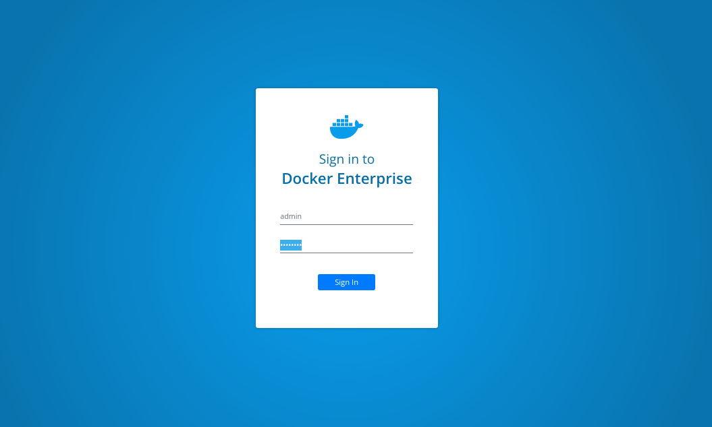
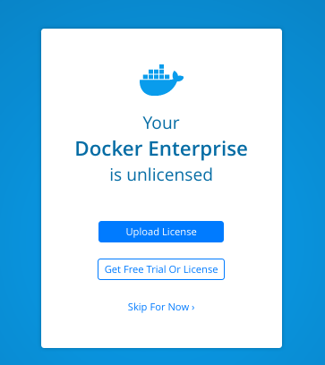
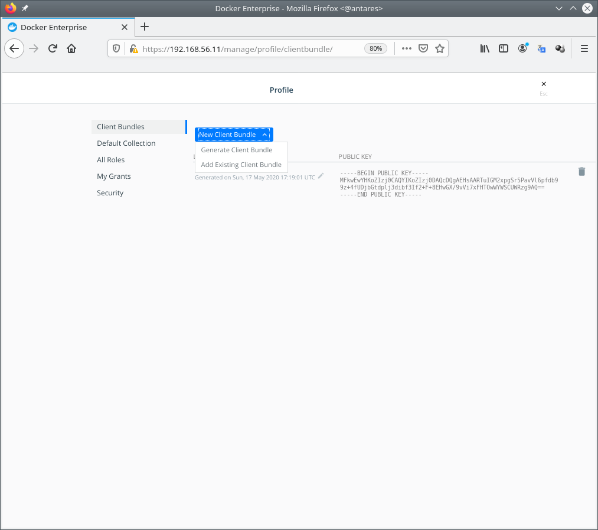

# Chapter 11

## Previous requirements
In this chapter we will learn Docker Swarm orchestrator features. We provide some labs at the end of the chapter that will help you understand and learn shown concepts. These labs can be run on your laptop or PC using the provided vagrant Docker Swarm environment or any already deployed Docker Swarm cluster at your own. Check additional information in this book's github code repository available in this link https://github.com/PacktPublishing/Docker-Certified-Associate-DCA-Exam-Guide.git.

You will need at least (all labs were tested on Linux and Windows):

    - Interne connection.
    - Some Linux, MacOS or Windows basic skills to edit files (using Notepad, Vim, Emacs or any other editor).
    - Git command-line, Vagrant and Virtualbox installed on your PC or laptop.
    - Already cloned book' s repository https://github.com/PacktPublishing/Docker-Certified-Associate-DCA-Exam-Guide.git.
    - Enough hardware resources: 2vCPU, 6GB of RAM per node (4 nodes) and 120 GB of available disk space on your hard drive for all nodes.

Extended instructions can be found on Github book's repository. These labs will use "environments/enterprise" folder for the creation of the virtual environment and "chapter8" folder.
>NOTE: To clone book' s repository https://github.com/PacktPublishing/Docker-Certified-Associate-DCA-Exam-Guide.git, prepare a directory on your laptop or PC and execute git clone https://github.com/PacktPublishing/Docker-Certified-Associate-DCA-Exam-Guide.git. This will download all required files on your current folder.

All labs will start executing vagrant up  using your command-line from the environment directory "environments/swarm". This command will start all the required nodes for you. If you are using your own Docker Enterprise cluster, you can use "chapter11" folder. Ask your Docker administrator for the cluster-required credentials for your environment to execute the provided labs.

Once all environment nodes are up and running, go to "chapter11" folder and follow each lab instructions.

After completed the labs (__chapters 12 and 13 labs require a running UCP environment__), you can use vagrant destroy -f from "environments/enterprise" directory to completely remove all the lab-deployed nodes and free your disk.

### Following labs can be found under chapter11 directory.


---

Before starting these labs, ensure all your nodes are up and running using _vagrant status_.

```
Docker-Certified-Associate-DCA-Exam-Guide/environments/enterprise$ vagrant status
--------------------------------------------------------------------------------------------
 DOCKER ENTERPRISE Vagrant Environment
 Engine Version: current
--------------------------------------------------------------------------------------------
Current machine states:

enterprise-node1          running (virtualbox)
enterprise-node2          running (virtualbox)
enterprise-node3          running (virtualbox)
enterprise-node4          running (virtualbox)

This environment represents multiple VMs. The VMs are all listed
above with their current state. For more information about a specific
VM, run `vagrant status NAME`.
 ```

## __Lab1__: Install UCP cluster

In this lab we will create a Docker Enterprise cluster from the very begining.

1 - Connect to enterprise-node1 and instal Docker Enterprise Engine:

 ```
Docker-Certified-Associate-DCA-Exam-Guide/environments/enterprise$ vagrant ssh enterprise-node1
--------------------------------------------------------------------------------------------
 DOCKER ENTERPRISE Vagrant Environment
 Engine Version: current
--------------------------------------------------------------------------------------------
....
....

vagrant@enterprise-node1:~$

vagrant@enterprise-node1:~$ sudo -s

root@enterprise-node1:~# export DOCKER_EE_URL="https://storebits.docker.com/ee/trial/sub-76c16081-298d-4950-8d02-7f5179771813"

root@enterprise-node1:~# export DOCKER_EE_VERSION=19.03

root@enterprise-node1:~# curl -fsSL "${DOCKER_EE_URL}/ubuntu/gpg" | apt-key add -

root@enterprise-node1:~# apt-key fingerprint 6D085F96

root@enterprise-node1:~# add-apt-repository "deb [arch=$(dpkg --print-architecture)] $DOCKER_EE_URL/ubuntu \
$(lsb_release -cs) \
stable-$DOCKER_EE_VERSION"

root@enterprise-node1:~# apt-get update -qq

root@enterprise-node1:~# apt-get install -qq docker-ee docker-ee-cli containerd.io
 ```

2 - Repeat above steps in enterprise-node2, enterprise-node3 and enterprise-node4.


3 - Once Docker Enterprise Engine is installed on all cluster nodes, we can proced to deploy UCP on first manager node. In this case we will start this lab cluster from enterprise-node1.

```
Docker-Certified-Associate-DCA-Exam-Guide/environments/enterprise$ vagrant ssh enterprise-node1

vagrant@enterprise-node1:~$ sudo -s
 ```

We will use ucp.vagrant.lab for the FQDN cluster name. Remember what we have learned in this chapter. If we were deploying this cluster on a real environment, we should be published UCP's FQDN's IP address on your external load balancer. In this lab we are just associating UCP's FQDN's IP address with the IP address of the first cluster node (10.10.10.11). We will use _--san_ argument to add this FQDN.

You can use deploy UCP interactively. In that case, we will use _docker container run --rm -it --name ucp -v /var/run/docker.sock:/var/run/docker.sock docker/ucp:3.2.5 install --interactive_. We will be asked for the required values to install UCP, such as the administrator username and his password and the additional SAN names to include in UCP's certificate. I recommend to avoid interactive installations because they are not reproducible. It is easier to include all required values for our UCP's installation a save the command-line used to install the product.

>NOTE: We added _--san 192.168.56.11_ to also include Vagrant's host-to-vm private IP to allow us to interact with the cluster.
```
root@enterprise-node1:~# docker container run --rm -it --name ucp \
>   -v /var/run/docker.sock:/var/run/docker.sock \
>   docker/ucp:3.2.5 install \
>   --host-address 10.10.10.11 \
>   --san ucp.vagrant.labs \
>   --san 192.168.56.11 \
>   --admin-username admin \
>   --admin-password changeme
Unable to find image 'docker/ucp:3.2.5' locally
3.2.5: Pulling from docker/ucp
9d48c3bd43c5: Pull complete
90d4790e3bd7: Pull complete
f25d13a4f3b8: Pull complete
Digest: sha256:e55a1428bbef6543d8aff87a71d998a69de202063fe785966dc9f40fed166bca
Status: Downloaded newer image for docker/ucp:3.2.5
INFO[0000] Your Docker daemon version 19.03.5, build 2ee0c57608 (4.4.0-116-generic) is compatible with UCP 3.2.5 (57c1024)
INFO[0000] Initializing New Docker Swarm
INFO[0000] Checking required ports for connectivity
INFO[0005] Checking required container images
INFO[0005] Pulling required images... (this may take a while)
INFO[0005] Pulling image: docker/ucp-agent:3.2.5
INFO[0009] Pulling image: docker/ucp-auth:3.2.5
INFO[0012] Pulling image: docker/ucp-auth-store:3.2.5
INFO[0019] Pulling image: docker/ucp-azure-ip-allocator:3.2.5
INFO[0022] Pulling image: docker/ucp-calico-cni:3.2.5
INFO[0030] Pulling image: docker/ucp-calico-kube-controllers:3.2.5
INFO[0034] Pulling image: docker/ucp-calico-node:3.2.5
INFO[0042] Pulling image: docker/ucp-cfssl:3.2.5
INFO[0045] Pulling image: docker/ucp-compose:3.2.5
INFO[0062] Pulling image: docker/ucp-controller:3.2.5
INFO[0073] Pulling image: docker/ucp-dsinfo:3.2.5
INFO[0075] Pulling image: docker/ucp-etcd:3.2.5
INFO[0080] Pulling image: docker/ucp-hyperkube:3.2.5
INFO[0098] Pulling image: docker/ucp-interlock:3.2.5
INFO[0100] Pulling image: docker/ucp-interlock-extension:3.2.5
INFO[0103] Pulling image: docker/ucp-interlock-proxy:3.2.5
INFO[0108] Pulling image: docker/ucp-interlock-config:3.2.5
INFO[0111] Pulling image: docker/ucp-kube-compose:3.2.5
INFO[0114] Pulling image: docker/ucp-kube-compose-api:3.2.5
INFO[0117] Pulling image: docker/ucp-kube-dns:3.2.5
INFO[0121] Pulling image: docker/ucp-kube-dns-dnsmasq-nanny:3.2.5
INFO[0124] Pulling image: docker/ucp-kube-dns-sidecar:3.2.5
INFO[0127] Pulling image: docker/ucp-metrics:3.2.5
INFO[0133] Pulling image: docker/ucp-pause:3.2.5
INFO[0135] Pulling image: docker/ucp-swarm:3.2.5
INFO[0138] Completed pulling required images
INFO[0141] Running install agent container ...
INFO[0000] Loading install configuration
INFO[0000] Running Installation Steps
INFO[0000] Step 1 of 35: [Setup Internal Cluster CA]
INFO[0003] Step 2 of 35: [Setup Internal Client CA]
INFO[0003] Step 3 of 35: [Initialize etcd Cluster]
INFO[0007] Step 4 of 35: [Set Initial Config in etcd]
INFO[0007] Step 5 of 35: [Deploy RethinkDB Server]
INFO[0009] Step 6 of 35: [Initialize RethinkDB Tables]
INFO[0010] Step 7 of 35: [Create Auth Service Encryption Key Secret]
INFO[0010] Step 8 of 35: [Deploy Auth API Server]
INFO[0014] Step 9 of 35: [Setup Auth Configuration]
INFO[0015] Step 10 of 35: [Deploy Auth Worker Server]
INFO[0017] Step 11 of 35: [Deploy UCP Proxy Server]
INFO[0018] Step 12 of 35: [Initialize Swarm v1 Node Inventory]
INFO[0018] Step 13 of 35: [Deploy Swarm v1 Manager Server]
INFO[0018] Step 14 of 35: [Deploy Internal Cluster CA Server]
INFO[0019] Step 15 of 35: [Deploy Internal Client CA Server]
INFO[0020] Step 16 of 35: [Deploy UCP Controller Server]
INFO[0029] Step 17 of 35: [Deploy Kubernetes API Server]
INFO[0036] Step 18 of 35: [Deploy Kubernetes Controller Manager]
INFO[0040] Step 19 of 35: [Deploy Kubernetes Scheduler]
INFO[0044] Step 20 of 35: [Deploy Kubelet]
INFO[0044] Step 21 of 35: [Deploy Kubernetes Proxy]
INFO[0045] Step 22 of 35: [Wait for Healthy UCP Controller and Kubernetes API]
INFO[0045] Step 23 of 35: [Create Kubernetes Pod Security Policies]
INFO[0046] Step 24 of 35: [Install Kubernetes CNI Plugin]
INFO[0076] Step 25 of 35: [Install KubeDNS]
INFO[0077] Step 26 of 35: [Create UCP Controller Kubernetes Service Endpoints]
INFO[0079] Step 27 of 35: [Install Metrics Plugin]
INFO[0081] Step 28 of 35: [Install Kubernetes Compose Plugin]
INFO[0086] Step 29 of 35: [Deploy Manager Node Agent Service]
INFO[0086] Step 30 of 35: [Deploy Worker Node Agent Service]
INFO[0086] Step 31 of 35: [Deploy Windows Worker Node Agent Service]
INFO[0086] Step 32 of 35: [Deploy Cluster Agent Service]
INFO[0086] Step 33 of 35: [Set License]
INFO[0086] Step 34 of 35: [Set Registry CA Certificates]
INFO[0086] Step 35 of 35: [Wait for All Nodes to be Ready]
INFO[0091] All Installation Steps Completed
root@enterprise-node1:~#
```

4 - We can now use our browser with _192.168.56.11_, which is the host-to-vm IP address. We will browse to _https://192.168.56.11_ (port 443 is used by default).



>NOTE: We used an auto-signed certificate, created with an internal CA, hence we will receive a security warning because our system will not trust this certificate. We will trust this certificate or simple follow your browser instructions to accept the risk and continue to our UCP's URL.

>NOTE: We will be asked to upload our license. You signed on Docker Hub and you asked for a Trial. We will use this trial license for these labs.




5 - To join the rest of nodes we will just use learned _docker swarm join_ command. UCP is a Docker Swarm cluster, although Kubernetes is also included. All Docker Swarm commands can be used here.
We will first get manager's join-token on enterprise-node1.

Docker-Certified-Associate-DCA-Exam-Guide/environments/enterprise$ vagrant ssh enterprise-node1

vagrant@enterprise-node1:~$  sudo docker swarm join-token manager
To add a manager to this swarm, run the following command:

    docker swarm join --token SWMTKN-1-3dj29hhaji3jvgn4bn39pkbsn9lju46n2ts8j2nqfp5w433dcj-ash0ayz4t046mnuq8h6b82trl 10.10.10.11:2377

We will now connect to enterprise-node2 to join this node as manager.
```
Docker-Certified-Associate-DCA-Exam-Guide/environments/enterprise$ vagrant ssh enterprise-node2

vagrant@enterprise-node2:~$ sudo docker swarm join --token SWMTKN-1-3dj29hhaji3jvgn4bn39pkbsn9lju46n2ts8j2nqfp5w433dcj-ash0ayz4t046mnuq8h6b82trl 10.10.10.11:2377
This node joined a swarm as a manager.
vagrant@enterprise-node2:~$ exit
```

We will execute the same command on enterprise-node3.
```
Docker-Certified-Associate-DCA-Exam-Guide/environments/enterprise$ vagrant ssh enterprise-node3

vagrant@enterprise-node3:~$ sudo docker swarm join --token SWMTKN-1-3dj29hhaji3jvgn4bn39pkbsn9lju46n2ts8j2nqfp5w433dcj-ash0ayz4t046mnuq8h6b82trl 10.10.10.11:2377
This node joined a swarm as a manager.
vagrant@enterprise-node3:~$ exit
```


6 - Now we will joing enterprise-node4 as worker. We will ask Docker Swarm for the worker's token.
```
zero@antares:~/Labs/Docker-Certified-Associate-DCA-Exam-Guide/environments/enterprise$ vagrant ssh enterprise-node1

vagrant@enterprise-node1:~$  sudo docker swarm join-token worker
To add a worker to this swarm, run the following command:

    docker swarm join --token SWMTKN-1-3dj29hhaji3jvgn4bn39pkbsn9lju46n2ts8j2nqfp5w433dcj-1tcie3nabe8zxvcbfafnmf8l7 10.10.10.11:2377
```

Then we will just join enterprise-node4 as worker.
```
zero@antares:~/Labs/Docker-Certified-Associate-DCA-Exam-Guide/environments/enterprise$ vagrant ssh enterprise-node4

vagrant@enterprise-node4:~$ sudo docker swarm join --token SWMTKN-1-3dj29hhaji3jvgn4bn39pkbsn9lju46n2ts8j2nqfp5w433dcj-1tcie3nabe8zxvcbfafnmf8l7 10.10.10.11:2377
This node joined a swarm as a worker.
vagrant@enterprise-node4:~$
```

7 - Now we get back again to any of the manager nodes to review the cluster status.
```
Docker-Certified-Associate-DCA-Exam-Guide/environments/enterprise$ vagrant ssh enterprise-node1

root@enterprise-node1:~# sudo docker node ls
ID                            HOSTNAME            STATUS              AVAILABILITY        MANAGER STATUS      ENGINE VERSION
fwq6bd8h7dz9o99sg84gk8eex *   enterprise-node1    Ready               Active              Leader              19.03.5
sgx9v5ytn4mggg9ui6qx7c2zs     enterprise-node2    Ready               Active              Reachable           19.03.5
sofmr1bgb5ma8tt1ldanwspf5     enterprise-node3    Ready               Active              Reachable           19.03.5
mlo7oaxuqlyu6oem8vs0r9i6i     enterprise-node4    Ready               Active                                  19.03.5

```

## Lab2 - Download admin's UCP bundle.

In this lab we will download admin's UCP bundle to use our Docker command-line client.

User's UCP bundle can be downloaded either using command-line requests to UCP's API or the Web UI. Let's review both methods.

### Download admin's UCP bundle using command-line.

1 - This method requires _jq_ and _unzip_ on your system. We will use enterprise-node3 as client node to connect to the cluster. First step will install _jq_ adn _unzip_ from Ubuntu repositories and the we will use curl to get admin's token and use it to generate a bundle package for us.
```
Docker-Certified-Associate-DCA-Exam-Guide/environments/enterprise$ vagrant ssh enterprise-node3

vagrant@enterprise-node3:~$ sudo apt-get install jq unzip -qq
```

2 - Now we can request authorization token for our user and then we will use it as header to obtain out client bundle.
```
vagrant@enterprise-node3:~$ AUTHTOKEN=$(curl -sk -d '{"username":"admin","password":"changeme"}' https://ucp.vagrant.labs/auth/login | jq -r .auth_token);echo ${AUTHTOKEN}
0ca68d03-2f9d-4173-9861-0f9caa301276

vagrant@enterprise-node3:~$ curl -sk -H "Authorization: Bearer $AUTHTOKEN" https://ucp.vagrant.labs/api/clientbundle -o ucp-bundle-admin.zip

vagrant@enterprise-node3:~$ ls
ucp-bundle-admin.zip
```

3 - We will create __"admin-bundle"__ directory and we will move __"ucp-bundle-admin.zip"__ there to uncompress it.
```
vagrant@enterprise-node3:~$ mkdir admin-bundle

vagrant@enterprise-node3:~$ mv ucp-bundle-admin.zip admin-bundle/

vagrant@enterprise-node3:~$ cd admin-bundle/

vagrant@enterprise-node3:~/admin-bundle$ unzip ucp-bundle-admin.zip
Archive:  ucp-bundle-admin.zip
 extracting: ca.pem
 extracting: cert.pem
 extracting: key.pem
 extracting: cert.pub
 extracting: env.ps1
 extracting: env.cmd
 extracting: kube.yml
 extracting: env.sh
 extracting: meta.json
 extracting: tls/docker/ca.pem
 extracting: tls/docker/cert.pem
 extracting: tls/docker/key.pem
 extracting: tls/kubernetes/ca.pem
 extracting: tls/kubernetes/cert.pem
 extracting: tls/kubernetes/key.pem
```

### Download admin's UCP bundle using your browser.
In this case, __"ucp-bundle-admin.zip"__ will be downloaded to your client host. It will work because _ucp.vagrant.labs" and 192.168.56.11 IP address are both included as aliases inside UCP's certificate.

1 - Navigate on the right-side panel to __"admin" > "My Profile"__. Then your first option will be __Client Bundles__.

Click on __"New Client Bundle"__ and choose __"Generate Client Bundle"__. This will download your admin's UCP client bundle in the location defined in your broser.



Locate your __"ucp-bundle-admin.zip"__ file and then you can follow the same steps described in __"Download admin's UCP bundle using command-line"__.


>NOTE: Client bundle will work for Linux, Windows and MacOSX docker clients. Obtaining this zip file may vary on different systems but you should get the same results.

__"ucp-bundle-admin.zip"__ package contains client certificates required to connect to out cluster. This will allow us to connect to either Docker Swarm or Kubernetes environments.

There are environment files to load variables in our session to help us include all the values required.


## Lab3 - Using admin's UCP bundle.

In this lab we will learn how to use our client bundle to connect to the cluster.

We will use enterprise-node3 node as client therefore we have used "Download admin's UCP bundle using command-line" procedure.

1 - Let's connect our enterprise-node3 Docker client. We will load the environment file using _source_ built-in command because we are using Linux.

>NOTE: If you are following this lab form your laptop or any other Microsoft Windows-based environemnt you should previously install docker a client (can be downloaded from UCP's Web UI in this link https://192.168.56.11/manage/dashboard/dockercli) and use appropriate _env.cmd_ or _env.ps1_ scripts.
>


```
vagrant@enterprise-node3:~/admin-bundle$ source env.sh

vagrant@enterprise-node3:~/admin-bundle$ env|egrep -e DOCKER -e KUBE
DOCKER_HOST=tcp://ucp.vagrant.labs:443
KUBECONFIG=/home/vagrant/admin-bundle/kube.yml
DOCKER_TLS_VERIFY=1
DOCKER_CERT_PATH=/home/vagrant/admin-bundle
```

We executed _env|egrep -e DOCKER -e KUBE_ to review the recently loaded variables.

2 - Now, all the commmands executed will be forwarded to the cluster. We will not use local Docker Engine. Let's execute a simple docker info and you will verify this.
```
vagrant@enterprise-node3:~/admin-bundle$ docker info
Client:
 Debug Mode: false
 Plugins:
  cluster: Manage Docker clusters (Docker Inc., v1.2.0)

Server:
 Containers: 88
  Running: 88
  Paused: 0
  Stopped: 0
 Images: 55
 Server Version: ucp/3.2.5
 Role: primary
 Strategy: spread
 Filters: health, port, containerslots, dependency, affinity, constraint, whitelist
 Nodes: 4
  enterprise-node1: 10.10.10.11:12376
   └ ID: 6LKN:MVU4:4BC3:MTWO:J2V7:UPPZ:6SUD:OEA6:LRBQ:ZESM:KCWC:KQTJ|10.10.10.11:12376
   └ Status: Healthy
   └ Containers: 37 (37 Running, 0 Paused, 0 Stopped)
   └ Reserved CPUs: 0 / 2
   └ Reserved Memory: 340 MiB / 4.052 GiB
   └ Labels: com.docker.security.apparmor=enabled, com.docker.security.seccomp=enabled, kernelversion=4.4.0-116-generic, operatingsystem=Ubuntu 16.04.4 LTS, ostype=linux, storagedriver=overlay2
   └ UpdatedAt: 2020-05-17T19:54:30Z
   └ ServerVersion: 19.03.5
  enterprise-node2: 10.10.10.12:12376
   └ ID: PYQK:AT74:IL5E:QXFH:74X4:BI4L:XGU4:OAXI:PXZR:7VDA:Y3CQ:3MFO|10.10.10.12:12376
   └ Status: Healthy
   └ Containers: 22 (22 Running, 0 Paused, 0 Stopped)
   └ Reserved CPUs: 0 / 2
   └ Reserved Memory: 0 B / 4.052 GiB
   └ Labels: com.docker.security.apparmor=enabled, com.docker.security.seccomp=enabled, kernelversion=4.4.0-116-generic, operatingsystem=Ubuntu 16.04.4 LTS, ostype=linux, storagedriver=overlay2
   └ UpdatedAt: 2020-05-17T19:54:29Z
   └ ServerVersion: 19.03.5
  enterprise-node3: 10.10.10.13:12376
   └ ID: 6FRV:VY2A:D7OY:XW5X:6Z57:EQN2:WYVD:EERE:JAZH:Q2ZL:FYFU:E4LA|10.10.10.13:12376
   └ Status: Healthy
   └ Containers: 22 (22 Running, 0 Paused, 0 Stopped)
   └ Reserved CPUs: 0 / 2
   └ Reserved Memory: 0 B / 4.052 GiB
   └ Labels: com.docker.security.apparmor=enabled, com.docker.security.seccomp=enabled, kernelversion=4.4.0-116-generic, operatingsystem=Ubuntu 16.04.4 LTS, ostype=linux, storagedriver=overlay2
   └ UpdatedAt: 2020-05-17T19:54:30Z
   └ ServerVersion: 19.03.5
  enterprise-node4: 10.10.10.14:12376
   └ ID: QKIQ:JPJO:PWLG:75MZ:6QMY:JXOX:3BNT:LXJ6:NCXZ:64YF:XZIU:NFM6|10.10.10.14:12376
   └ Status: Healthy
   └ Containers: 7 (7 Running, 0 Paused, 0 Stopped)
   └ Reserved CPUs: 0 / 2
   └ Reserved Memory: 0 B / 4.052 GiB
   └ Labels: com.docker.security.apparmor=enabled, com.docker.security.seccomp=enabled, kernelversion=4.4.0-116-generic, operatingsystem=Ubuntu 16.04.4 LTS, ostype=linux, storagedriver=overlay2
   └ UpdatedAt: 2020-05-17T19:54:24Z
   └ ServerVersion: 19.03.5
 Cluster Managers: 3
  enterprise-node3: Healthy
   └ Orca Controller: https://10.10.10.13:443
   └ Classic Swarm Manager: tcp://10.10.10.13:2376
   └ Engine Swarm Manager: tcp://10.10.10.13:12376
   └ KV: etcd://10.10.10.13:12379
  enterprise-node1: Healthy
   └ Orca Controller: https://10.10.10.11:443
   └ Classic Swarm Manager: tcp://10.10.10.11:2376
   └ Engine Swarm Manager: tcp://10.10.10.11:12376
   └ KV: etcd://10.10.10.11:12379
  enterprise-node2: Healthy
   └ Orca Controller: https://10.10.10.12:443
   └ Classic Swarm Manager: tcp://10.10.10.12:2376
   └ Engine Swarm Manager: tcp://10.10.10.12:12376
   └ KV: etcd://10.10.10.12:12379
 Plugins:
  Volume:
  Network:
  Log:
 Swarm: active
  NodeID: fwq6bd8h7dz9o99sg84gk8eex
  Is Manager: true
  ClusterID: t4xq3t5ybzp3biqxtsy8fkuo1
  Managers: 3
  Nodes: 4
  Default Address Pool: 10.0.0.0/8
  SubnetSize: 24
  Data Path Port: 4789
  Orchestration:
   Task History Retention Limit: 5
  Raft:
   Snapshot Interval: 10000
   Number of Old Snapshots to Retain: 0
   Heartbeat Tick: 1
   Election Tick: 10
  Dispatcher:
   Heartbeat Period: 5 seconds
  CA Configuration:
   Expiry Duration: 3 months
   Force Rotate: 0
   External CAs:
     cfssl: https://10.10.10.13:12381/api/v1/cfssl/sign
     cfssl: https://10.10.10.11:12381/api/v1/cfssl/sign
     cfssl: https://10.10.10.12:12381/api/v1/cfssl/sign
  Autolock Managers: false
  Root Rotation In Progress: false
  Node Address: 10.10.10.11
  Manager Addresses:
   10.10.10.11:2377
   10.10.10.12:2377
   10.10.10.13:2377
 Kernel Version: 4.4.0-116-generic
 Operating System: linux
 Architecture: amd64
 CPUs: 8
 Total Memory: 16.21GiB
 Name: ucp-controller-10.10.10.11
 ID: t4xq3t5ybzp3biqxtsy8fkuo1
 Docker Root Dir:
 Debug Mode: false
 Registry: https://index.docker.io/v1/
 Labels:
  com.docker.ucp.license_key=unlicensed
  com.docker.ucp.license_max_engines=0
  com.docker.ucp.license_expires=EXPIRED
 Experimental: false
 Insecure Registries:
  127.0.0.0/8
 Live Restore Enabled: false

WARNING: No kernel memory limit support
```


