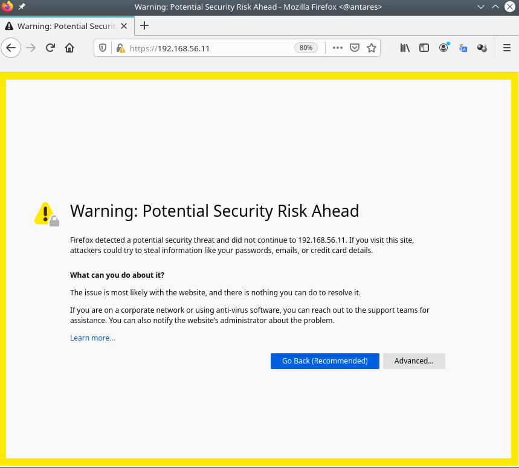
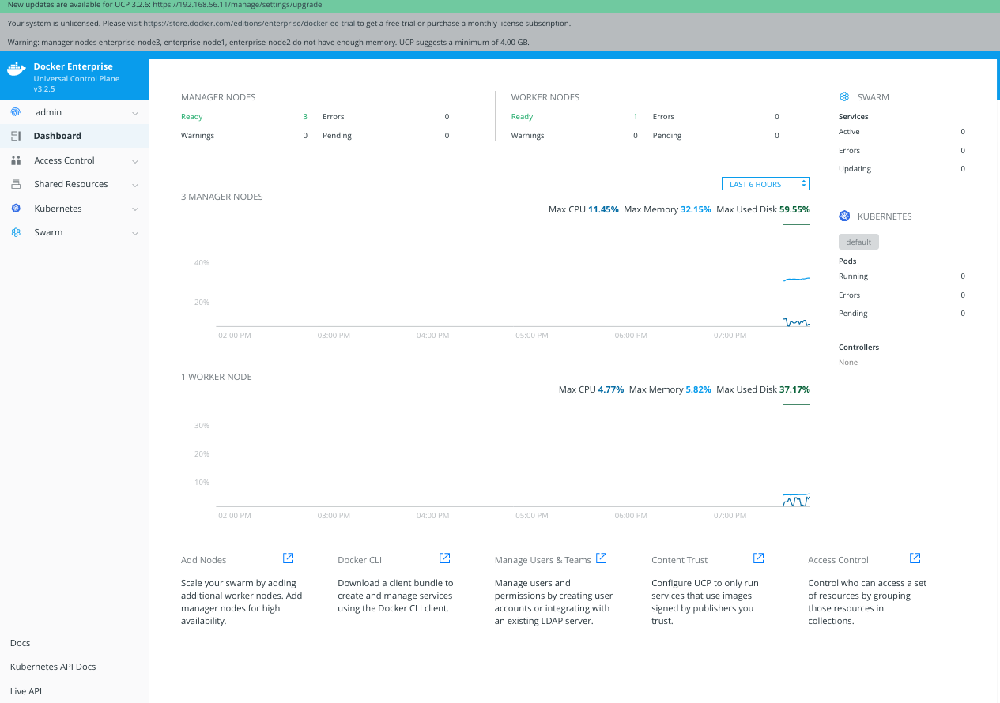
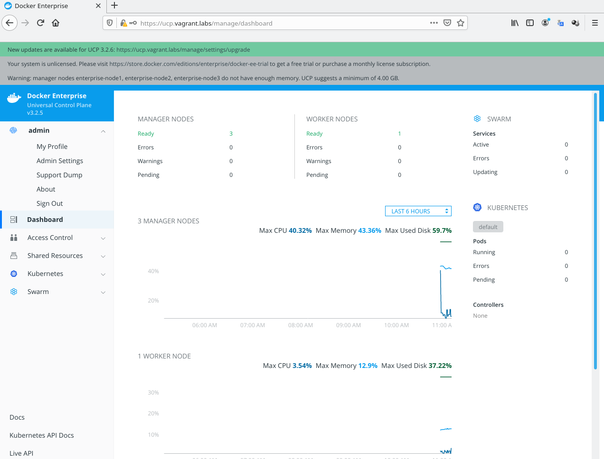
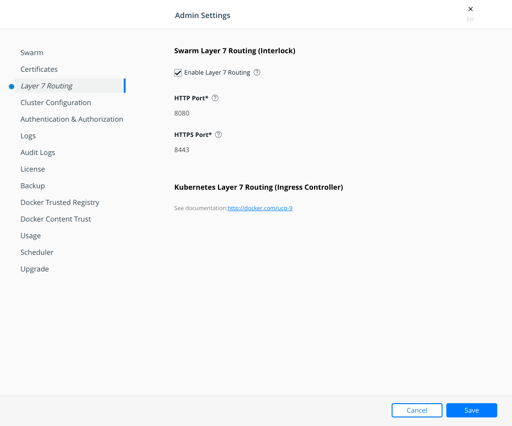
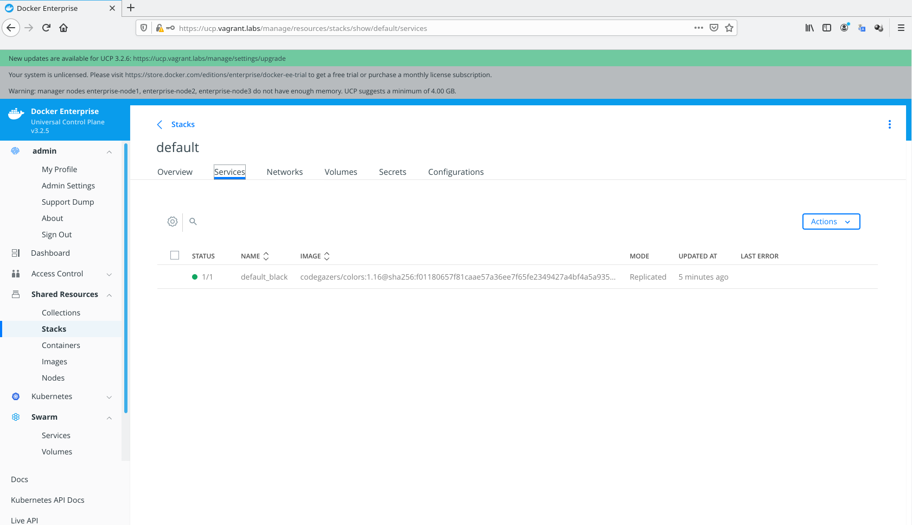

# Chapter 12

## Previous requirements
In this chapter we will learn Docker Swarm orchestrator features. We provide some labs at the end of the chapter that will help you understand and learn shown concepts. These labs can be run on your laptop or PC using the provided vagrant Docker Enterprise environment or any already deployed Docker Enteprise cluster at your own. Check additional information in this book's github code repository available in this link https://github.com/PacktPublishing/Docker-Certified-Associate-DCA-Exam-Guide.git.

You will need at least (all labs were tested on Linux and Windows):

    - Internet connection.
    - Some Linux, MacOS or Windows basic skills to edit files (using Notepad, Vim, Emacs or any other editor).
    - Git command-line, Vagrant and Virtualbox installed on your PC or laptop.
    - Already cloned book' s repository https://github.com/PacktPublishing/Docker-Certified-Associate-DCA-Exam-Guide.git.
    - Enough hardware resources: 2vCPU, 6GB of RAM per node (4 nodes) and 120 GB of available disk space on your hard drive for all nodes.

Extended instructions can be found on Github book's repository. These labs will use "environments/enterprise" folder for the creation of the virtual environment and "chapter12" folder.
>NOTE: To clone book' s repository https://github.com/PacktPublishing/Docker-Certified-Associate-DCA-Exam-Guide.git, prepare a directory on your laptop or PC and execute git clone https://github.com/PacktPublishing/Docker-Certified-Associate-DCA-Exam-Guide.git. This will download all required files on your current folder.

All labs will start executing vagrant up  using your command-line from the environment directory "environments/enterprise". This command will start all the required nodes for you. If you are using your own Docker Enterprise cluster, you can use "chapter12" folder. Ask your Docker administrator for the cluster-required credentials for your environment to execute the provided labs.

Once all environment nodes are up and running, go to "chapter12" folder and follow each lab instructions.

After completed the labs (__chapters 12 and 13 labs require a running UCP environment__), you can use vagrant destroy -f from "environments/enterprise" directory to completely remove all the lab-deployed nodes and free your disk.

### Following labs can be found under chapter12 directory.


---

Before starting these labs, ensure all your nodes are up and running using _vagrant status_.

```
Docker-Certified-Associate-DCA-Exam-Guide/environments/enterprise$ vagrant status
--------------------------------------------------------------------------------------------
 DOCKER ENTERPRISE Vagrant Environment
 Engine Version: current
--------------------------------------------------------------------------------------------
Current machine states:

enterprise-node1          running (virtualbox)
enterprise-node2          running (virtualbox)
enterprise-node3          running (virtualbox)
enterprise-node4          running (virtualbox)

This environment represents multiple VMs. The VMs are all listed
above with their current state. For more information about a specific
VM, run `vagrant status NAME`.
 ```
---
>__NOTE: These labs require an already running Docker Entreprise platform. It is recommended to execute these labs after chapter11 because we learned in that chapter how to deploy Docker Entperise platform. If you have not destroyed your enterprise labs environment, you wil have a Docker Enteprise platform already to deploy these labs.__
---


## __Lab1__: Enable Interlock and verify its components.

In this lab we will enable Interlock on Docker Enterprise cluster and we will review its components. Interlock's components were described in chapter 12.

>NOTE: For easy access, add "192.168.56.11 ucp.vagrant.labs" to your hosts file. This will help us accessing UCP directly. We prepared the environment with internal resolution. It will work for you.

1 - Connect to our already deployed Docker Enterprise's UCP's Web UI. If you are using the provided Vagrant environment your UCP Web UI will be accesible in https://ucp.vagrant.labs (we haven't used any external load balancer for these labs, therefore this FQDN points to first node's IP address). If you haven't changed installation's "admin" user's password it will be "changeme". We will get into "admin" > "Admin Settings" configuration settings. Notice that "Admin Settings" menu will be available to any UCP's administrator user. In fact you will find these settings inside each administrator's username menu.

You will get a warning message because we are using autosigned-certificates if you didn't accept them yet. We will trust this certificate or simple follow your browser instructions to accept the risk and continue to our UCP's URL.



Login page will appear and we will use "admin" username and its password (defined during installation).


We will have access to UCP's Dashboard.



We will click on admin's username and we will get into "Admin Settings" endpoint.



Then we will navigate to "Layer 7 Routing (Interlock)" features and we will enable "Layer 7 Routing"



2 - Once Interlock is enabled, its services will be visible and running in our cluster. Let's connect to the cluster using UCP's admin's bundle. If you are not sure how to use this feature, please review chapter 11 labs section (Lab2). If you followed chapter 11 labs, your___ node has already downloaded your UCP's admin's bundle. We will now load UCP's environment in our session:


 ```
Docker-Certified-Associate-DCA-Exam-Guide/environments/enterprise$ vagrant ssh enterprise-node1
--------------------------------------------------------------------------------------------
 DOCKER ENTERPRISE Vagrant Environment
 Engine Version: current
--------------------------------------------------------------------------------------------
....
....

vagrant@enterprise-node3:~$

vagrant@enterprise-node3:~$ cd ~/admin-bundle/

vagrant@enterprise-node3:~/admin-bundle$ source env.sh

vagrant@enterprise-node3:~/admin-bundle$ cd 
```

3 - We list deployed services to find out Interlock's components:
```
vagrant@enterprise-node3:~/admin-bundle$ docker service ls
ID                  NAME                      MODE                REPLICAS            IMAGE                                  PORTS
mcyb2zg252az        ucp-auth-api              global              3/3                 docker/ucp-auth:3.2.5                  
jvbj9jrlvc02        ucp-auth-worker           global              3/3                 docker/ucp-auth:3.2.5                  
xfbvp7q9athi        ucp-cluster-agent         replicated          1/1                 docker/ucp-agent:3.2.5                 
xs5bti3gq0dt        ucp-interlock             replicated          1/1                 docker/ucp-interlock:3.2.5             
mqfep3upef2i        ucp-interlock-extension   replicated          1/1                 docker/ucp-interlock-extension:3.2.5   
kkv97z498ayk        ucp-interlock-proxy       replicated          2/2                 docker/ucp-interlock-proxy:3.2.5       *:8080->80/tcp, *:8443->443/tcp
k67fzi3o1u9s        ucp-manager-agent         global              3/3                 docker/ucp-agent:3.2.5                 
k6auso5rqq3l        ucp-worker-agent-win-x    global              0/0                 docker/ucp-agent-win:3.2.5             
tpvwjk76p8me        ucp-worker-agent-x        global              1/1                 docker/ucp-agent:3.2.5                 
```

Notice that only __ucp-interlock-proxy__ component is published. As we learned this component is a reverse proxy and it should be able to access requests from users. By default, ports 8080 and 8443 wil be used for HTTP and HTTPS communications, respectively. These ports can be changed from "Layer 7 Routing (Interlock)" page.

```
vagrant@enterprise-node3:~/admin-bundle$ docker service ps ucp-interlock-proxy
ID                  NAME                    IMAGE                              NODE                DESIRED STATE       CURRENT STATE               ERROR               PORTS
zenue531bzbm        ucp-interlock-proxy.1   docker/ucp-interlock-proxy:3.2.5   enterprise-node1    Running             Running about an hour ago                       
p7vodxikfdww        ucp-interlock-proxy.2   docker/ucp-interlock-proxy:3.2.5   enterprise-node4    Running             Running about an hour ago                       
v
```

__ucp-interlock-proxy__ component will deploy more than one instance for better performance while __ucp-interlock__ and __ucp-interlock-extension__ will run just one replica. __ucp-interlock__ only runs on manager nodes because it requires access to UCP's API.

NOTE: There are several configurations that can improve Interlock's security for production environments. Please take a look at [Configure layer 7 routing for production](https://docs.docker.com/ee/ucp/interlock/deploy/production/) for best practices.

4 - Router Mesh allows us to access __ucp-interlock-proxy__ from any UCP's cluster node. Therefore, we can access even locally although this component is not running on enterprise-node3.
```
vagrant@enterprise-node3:~/admin-bundle$ curl 0.0.0.0:8080
<!DOCTYPE html>
<html>
<head>
<title>Error</title>
<style>
    body {
        width: 35em;
        margin: 0 auto;
        font-family: Tahoma, Verdana, Arial, sans-serif;
    }
</style>
</head>
<body>
<h1>An error occurred.</h1>
<p>Sorry, the page you are looking for is currently unavailable.<br/>
Please try again later.</p>
<p>If you are the system administrator of this resource then you should check
the <a href="http://nginx.org/r/error_log">error log</a> for details.</p>
<p><em>Faithfully yours, nginx.</em></p>
</body>
</html>
```

Service is up and running but we haven't defined any default service.

5 - Let's define a stack with a simple service to get all default traffic (without any specific header). For these labs we will deploy the simple "COLORS" application, used on different chapters in this book. It is quite simple but it can give us a good idea for more complex deployments. Let's define a black page as default for Interlock.
We will create a [default-color.stack.yaml](./default-color.stack.yaml) using your favorite editor on node enterprise-node3 with the following content:
```
version: "3.2"
services:
  black:
    image: codegazers/colors:1.16
    environment:
      COLOR: "black"
    deploy:
      replicas: 1
      labels:
        com.docker.lb.default_backend: "true"
        com.docker.lb.port: 3000
    networks:
      - black-network

networks:
  black-network:

```

>__NOTE: You can also clone [Docker-Certified-Associate-DCA-Exam-Guide](https://github.com/frjaraur/Docker-Certified-Associate-DCA-Exam-Guide.git) books' Github code repository.__
>


>__NOTE: We can also use this simple trick:__
>
>```
>cat <<-EOF>default-color.stack.yaml
>version: "3.2"
>
>services:
>  black:
>    image: codegazers/colors:1.16
>    environment:
>      COLOR: "black"
>    deploy:
>      replicas: 1
>      labels:
>        com.docker.lb.default_backend: "true"
>        com.docker.lb.port: 3000
>    networks:
>      - black-network
>
>networks:
>  black-network:
>
>EOF
>```


6 - We now create this default stack.
```
vagrant@enterprise-node3:~$ docker stack deploy -c default-color.stack.yaml default
Creating network default_black-network
Creating service default_black
```
We can review "default" stack either using Web UI or command-line:



```
vagrant@enterprise-node3:~$ docker stack ls
NAME                SERVICES            ORCHESTRATOR
default             1                   Swarm
vagrant@enterprise-node3:~$ docker stack ps default 
ID                  NAME                IMAGE                    NODE                DESIRED STATE       CURRENT STATE           ERROR               PORTS
lx0rp9cj9zuw        default_black.1     codegazers/colors:1.16   enterprise-node4    Running             Running 7 minutes ago                       
vagrant@enterprise-node3:~$ 
```

Notice that default_black service is deployed on node enterprise-node4. This node has less workloads because it is a worker node and UCP's core components are running on manager nodes.

7 - We can now review default page executing ___curl___ again:
```
vagrant@enterprise-node3:~$ curl 0.0.0.0:8080/                      
<html>
<head>
    <title>black</title>
    <meta charset="utf-8" />
    <style>
        body {
            background-color: black;
        }
        .center {
            padding: 70px 0;
        }
        h2 {
            color: grey;
            text-align: left;
            font-family: "Sans-serif", Arial;
            font-style: oblique;
            font-size: 14px;
        }
        table {
            border-collapse: collapse;
            margin-left:auto; 
            margin-right:auto;
            background-color: #F0F8FF;
        }

        table, th, td {
            border: 1px solid black;
            
        }
        tr:hover {background-color: #DCDCDC}

        p.padding {
            padding-top: 2cm;
        }
    </style>
</head>
<body>
<div class="center">
    <table style="float:center" >
        <tr><td>Container IP:</td><td> 10.0.12.10 172.18.0.5</td></tr>
        <tr><td>Client IP:</td><td>undefined</td></tr>
        <tr><td>Container Name:</td><td>cb9fe97655c3</td></tr>
        <tr><td>Color:</td><td>black</td></tr>
        <tr><td>Application Version:</td><td>1.20</td></tr>
    </table>
</div>
</body>

</html>
</body>
</html>
```

There is "/text" endpoint in this application that show results easier:
```
vagrant@enterprise-node3:~$ curl 0.0.0.0:8080/text
APP_VERSION: 1.20
COLOR: black
CONTAINER_NAME: cb9fe97655c3
CONTAINER_IP:  10.0.12.10 172.18.0.5
CLIENT_IP: 10.0.0.4
CONTAINER_ARCH: linux
```

## __Lab2__: Simple application publishing for specific host headers.

In this lab we will use Interlock deploying an application with specific host headers. This is the normal behavior and allows us to deploy multiple applications using just one published service (interlock-proxy) within the cluster. This improves security and applications management.

1 - Let's deploy a COLORS application with 3 replicas. In this case we will deploy random colors backends, leaving COLORS variable empty.
We will create a [colors.stack.yaml](./colors.stack.yaml) using your favorite editor on node enterprise-node3 with the following content:
```
version: "3.2"
services:
  colors:
    image: codegazers/colors:1.16
    deploy:
      replicas: 3
      labels:
        com.docker.lb.hosts: colors.lab.local
        com.docker.lb.network: colors-network
        com.docker.lb.port: 3000
    networks:
      - colors-network

networks:
  colors-network:
```

2 - We deploy this new stack and review how interlock changed.
```
vagrant@enterprise-node3:~$ docker stack deploy -c colors.stack.yaml colors
Creating network colors_colors-network
Creating service colors_colors

vagrant@enterprise-node3:~$ curl 0.0.0.0:8080/text
APP_VERSION: 1.20
COLOR: black
CONTAINER_NAME: cb9fe97655c3
CONTAINER_IP:  10.0.12.10 172.18.0.5
CLIENT_IP: 10.0.0.4
CONTAINER_ARCH: linux
```

As expected, default backend has not changed. We will need to use defined specific header.

3 - Let's try now using "colors.lab.local" host header:
```
vagrant@enterprise-node3:~$ curl -H "host: colors.lab.local" 0.0.0.0:8080/text
APP_VERSION: 1.20
COLOR: yellow
CONTAINER_NAME: a980afe726a4
CONTAINER_IP:  10.0.14.3 172.18.0.6
CLIENT_IP: 10.0.0.4
CONTAINER_ARCH: linux

vagrant@enterprise-node3:~$ curl -H "host: colors.lab.local" 0.0.0.0:8080/text
APP_VERSION: 1.20
COLOR: yellow
CONTAINER_NAME: a980afe726a4
CONTAINER_IP:  10.0.14.3 172.18.0.6
CLIENT_IP: 10.0.0.4
CONTAINER_ARCH: linux

vagrant@enterprise-node3:~$ curl -H "host: colors.lab.local" 0.0.0.0:8080/text
APP_VERSION: 1.20
COLOR: grey
CONTAINER_NAME: a63603b6eb92
CONTAINER_IP:  10.0.14.4 172.18.0.3
CLIENT_IP: 10.0.0.4
CONTAINER_ARCH: linux

vagrant@enterprise-node3:~$ curl -H "host: colors.lab.local" 0.0.0.0:8080/text
APP_VERSION: 1.20
COLOR: grey
CONTAINER_NAME: a63603b6eb92
CONTAINER_IP:  10.0.14.4 172.18.0.3
CLIENT_IP: 10.0.0.4
CONTAINER_ARCH: linux

vagrant@enterprise-node3:~$ curl -H "host: colors.lab.local" 0.0.0.0:8080/text
APP_VERSION: 1.20
COLOR: white
CONTAINER_NAME: 7af627b31d04
CONTAINER_IP:  10.0.14.5 172.19.0.4
CLIENT_IP: 10.0.0.4
CONTAINER_ARCH: linux
vagrant@enterprise-node3:~$ 
```

We get different "COLORS" application's backends (yellow, grey and white). It wors as expected.

>NOTE: We can test "COLORS" applications' deployments using our web browser and either modifying requests headers with some browser extensions or add FQDN application's entries in our __hosts__ file using 192.168.56.11 (internal host-to-VM IP address). Anyway, it is easier to use curl with "/text" endpoint because "COLORS" application is prepared for these labs.

4 - We can remove this stack using ___docker stack rm___:
```
vagrant@enterprise-node3:~$ docker stack rm colors
Removing service colors_colors
Removing network colors_colors-network
Failed to remove network 4kmv0mzre5432o79je0b63rve: Error response from daemon: Error response from daemon: rpc error: code = FailedPrecondition desc = network 4kmv0mzre5432o79je0b63rve is in use by service kkv97z498ayk9nv7pnu4xf8t8Failed to remove some resources from stack: colors
```

Notice the error received. This is very interesting and a normal behavior using Interlock. This error means that interlock-proxy service is attached to our application's network. This is the normal behavior as we described in chapter 12. We will execute doker stack rm some seconds after getting this error because Interlock will notice the changes and automatically interlock-proxy will be reloaded, freeing application's network.

```
vagrant@enterprise-node3:~$ docker stack rm colors
Removing network colors_colors-network
vagrant@enterprise-node3:~$ 
```

Let's deploy something more complicated.

## __Lab3__: Simple application redirection.

In this lab we will enable redirection for a website migration for example. We will forward all requests send to http://old.lab.local to a new webserver publishing http://new.lab.local. Instead of stacks, for this quick lab we will use simple services. Remember that is recommended to use stacks instead of services for production because stack files can be stored on git environments to follow common CI/CD releases numbers.

>__NOTE: All these labs should be executed connected to your UCP cluster using UCP's bundle. In these labs we are using enterprise-node3 because we downloaded the admin user's bundle in previous chapters' labs.__

1 - First we will create an overaly network because Interlock needs to be able to forward requests to our new service. Interlock's proxy component will connect to this network and forward requests to our new application's backends.
```
vagrant@enterprise-node3:~$ docker network create -d overlay redirect
```

2 - Now we will create out new webserver service. For this example to work it is not necessary to include an old webserver because all requests will be forwarded to the new one.
```
vagrant@enterprise-node3:~$  docker service create --name new-webserver \
--network redirect \
--label com.docker.lb.hosts=old.lab.local,new.lab.local \
--label com.docker.lb.port=80 \
--label com.docker.lb.redirects=http://old.lab.local,http://new.lab.local \
nginx:alpine
```

3 - Now we will test new.lab.local and old.lab.local URLs and review their results:
```
vagrant@enterprise-node3:~$ curl -H "host: new.lab.local" 0.0.0.0:8080
<!DOCTYPE html>
<html>
<head>
<title>Welcome to nginx!</title>
<style>
    body {
        width: 35em;
        margin: 0 auto;
        font-family: Tahoma, Verdana, Arial, sans-serif;
    }
</style>
</head>
<body>
<h1>Welcome to nginx!</h1>
<p>If you see this page, the nginx web server is successfully installed and
working. Further configuration is required.</p>

<p>For online documentation and support please refer to
<a href="http://nginx.org/">nginx.org</a>.<br/>
Commercial support is available at
<a href="http://nginx.com/">nginx.com</a>.</p>

<p><em>Thank you for using nginx.</em></p>
</body>
</html>
```

new.lab.local works as expected. Let's test old.lab.local.

```
vagrant@enterprise-node3:~/admin-bundle$ curl -H "host: old.lab.local" 0.0.0.0:8080
<html>
<head><title>302 Found</title></head>
<body bgcolor="white">
<center><h1>302 Found</h1></center>
<hr><center>nginx/1.14.2</center>
</body>
</html>
```

We have a redirection therefore we must add ___-L___ to ___curl___ to follow redirections (if you tested using your web browser you will probably be already redirected and you will have a DNS resolution error if you didn't add new.lab.local).
```
vagrant@enterprise-node3:~$ curl -L -H "host: old.lab.local" 0.0.0.0:8080
curl: (6) Could not resolve host: new.lab.local
```

This error is normal because we have been redirected but we are using host headers to manage curl requests. In this case it is not enough. To solve this issue we should resolve new.lab.local resolution to any of the hosts included in UCP's cluster.

Redirection worked as expected.

4 - We remove now our new-webserver service and redirect network (remember that overlay network will not be removed until interlock-proxy service is reloaded with the new changes). 
```
vagrant@enterprise-node3:~$ docker service remove new-webserver
new-webserver
```

If you wait some seconds (30s) you will be able to remove redirect overlay network without any issue.
```
vagrant@enterprise-node3:~$ docker network rm redirect
redirect
```

## __Lab4__:Publishing a service securely using Interlock with TLS

In this lab we will enable certificates for a "RED COLOR" application.

1 - First we will create our application's certificate. We have to ensure that our FQDN application's hostname is included in the certificate. We will use ___openssl___ with a simple CName to include "red.lab.local".
```
vagrant@enterprise-node3:~$ openssl req -x509 \
-nodes -days 3650 -newkey rsa:2048 \
-keyout red.lab.local.key -out red.lab.local.crt -subj "/CN=red.lab.local"
```

2 - Now we will prepare our RED COLOR application's stack [red-ssl.stack.yaml](./red-ssl.stack.yaml). Use your favorite editor and create __red-ssl-.stack.yaml__ on enterprise-node3:
```
version: "3.2"
services:
    red:
        image: codegazers/colors:1.16
        environment:
          COLOR: "red"
        deploy:
            replicas: 1
            labels:
                com.docker.lb.hosts: red.lab.local
                com.docker.lb.network: red-network
                com.docker.lb.port: 3000
                com.docker.lb.ssl_cert: red_red.lab.local.cert
                com.docker.lb.ssl_key: red_red.lab.local.key
        networks:
        - red-network
networks:
    red-network:
        driver: overlay
secrets:
    red.lab.local.cert:
        file: ./red.lab.local.cert
    red.lab.local.key:
        file: ./red.lab.local.key
```

3 - We now deploy this new stack:
```
vagrant@enterprise-node3:~$ docker stack deploy -c red-ssl.stack.yaml red
Creating network red_red-network
Creating secret red_colors.lab.local.key
Creating secret red_colors.lab.local.cert
Creating service red_red
vagrant@enterprise-node3:~$ 
```

4 - 