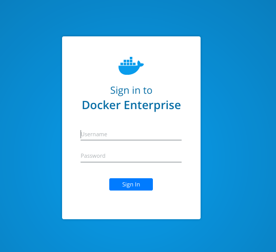
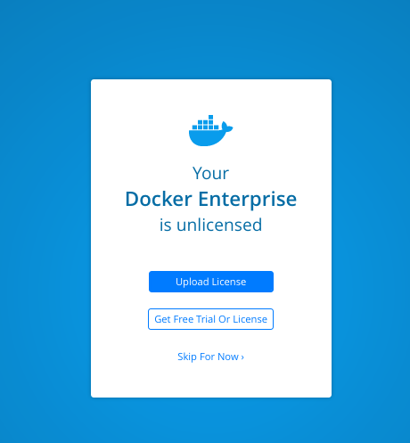
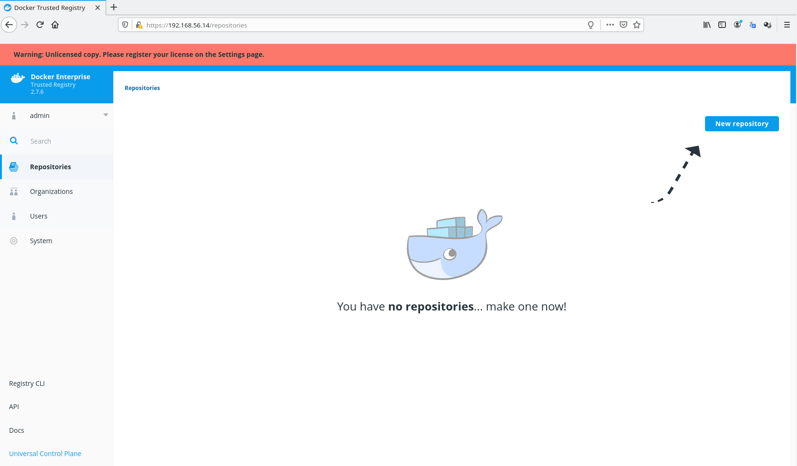

# Chapter 13

## Previous requirements
In this chapter we will learn with labs some Docker Enterprise's DTR's features. We provide some labs at the end of the chapter that will help you understand and learn shown concepts. These labs can be run on your laptop or PC using the provided vagrant Docker Enterprise environment or any already deployed Docker Enteprise cluster at your own. Check additional information in this book's github code repository available in this link https://github.com/PacktPublishing/Docker-Certified-Associate-DCA-Exam-Guide.git.

You will need at least (all labs were tested on Linux and Windows):

    - Internet connection.
    - Some Linux, MacOS or Windows basic skills to edit files (using Notepad, Vim, Emacs or any other editor).
    - Git command-line, Vagrant and Virtualbox installed on your PC or laptop.
    - Already cloned book' s repository https://github.com/PacktPublishing/Docker-Certified-Associate-DCA-Exam-Guide.git.
    - Enough hardware resources: 2vCPU, 6GB of RAM per node (4 nodes) and 120 GB of available disk space on your hard drive for all nodes.

Extended instructions can be found on Github book's repository. These labs will use "environments/enterprise" folder for the creation of the virtual environment and "chapter13" folder.
>NOTE: To clone book' s repository https://github.com/PacktPublishing/Docker-Certified-Associate-DCA-Exam-Guide.git, prepare a directory on your laptop or PC and execute git clone https://github.com/PacktPublishing/Docker-Certified-Associate-DCA-Exam-Guide.git. This will download all required files on your current folder.

All labs will start executing vagrant up  using your command-line from the environment directory "environments/enterprise". This command will start all the required nodes for you. If you are using your own Docker Enterprise cluster, you can use "chapter13" folder. Ask your Docker administrator for the cluster-required credentials for your environment to execute the provided labs.

Once all environment nodes are up and running, go to "chapter12" folder and follow each lab instructions.

After completed the labs (__chapters 12 and 13 labs require a running UCP environment__), you can use vagrant destroy -f from "environments/enterprise" directory to completely remove all the lab-deployed nodes and free your disk.

### Following labs can be found under chapter13 directory.


---

Before starting these labs, ensure all your nodes are up and running using _vagrant status_.

```
Docker-Certified-Associate-DCA-Exam-Guide/environments/enterprise$ vagrant status
--------------------------------------------------------------------------------------------
 DOCKER ENTERPRISE Vagrant Environment
 Engine Version: current
--------------------------------------------------------------------------------------------
Current machine states:

enterprise-node1          running (virtualbox)
enterprise-node2          running (virtualbox)
enterprise-node3          running (virtualbox)
enterprise-node4          running (virtualbox)

This environment represents multiple VMs. The VMs are all listed
above with their current state. For more information about a specific
VM, run `vagrant status NAME`.
 ```
---
>__NOTE: These labs require an already running Docker Entreprise platform. It is recommended to execute these labs after chapter11 because we learned in that chapter how to deploy Docker Entperise platform. If you have not destroyed your enterprise labs environment, you wil have a Docker Enteprise platform already to deploy these labs.__
---


## __Lab1__: Install DTR.

In this lab we will install DTR on enterprise-node4. This is a requirement if you are using provided enterprise environment becaue this is the only worker node.

1 - We can launch DTR installation from any node because we have to include one UCP administrator username and its password (we can use interactive mode to be asked for each paramenter).

We will continue using enterprise-node3 as main node for these labs.

 ```
Docker-Certified-Associate-DCA-Exam-Guide/environments/enterprise$ vagrant ssh enterprise-node3
--------------------------------------------------------------------------------------------
 DOCKER ENTERPRISE Vagrant Environment
 Engine Version: current
--------------------------------------------------------------------------------------------
....
....

vagrant@enterprise-node3:~$ sudo -s

root@enterprise-node3:~# 
```

Then we execute DTR installation.
Notice that we are ading UCP's CA. We can download it or just add this built-in to obtain its value on the fly. It is required the UCP's URL and one administrator account. We have to include DTR's external URL. Because we are not going to deploy DTR with high availability, we have just used enterprise-node4's IP address as external URL. To deploy DTR in production, we will use an external load balancer and include all replicas' URLs. In that case, we need to deploy external storage to allow replicas' to share data. In this lab we will use internal volumes.

```
root@enterprise-node3:~# docker run -it --rm \
docker/dtr:2.7.6 install \
--dtr-external-url https://192.168.56.14 \
--ucp-node enterprise-node4 \
--ucp-username admin \
--ucp-password changeme \
--ucp-url https://192.168.56.11 \
--ucp-ca "$(curl -s -k https://192.168.56.11/ca)"
Unable to find image 'docker/dtr:2.7.6' locally
2.7.6: Pulling from docker/dtr
89d9c30c1d48: Already exists 
d3d3af117bcf: Pull complete 
6ba0fd7b3186: Pull complete 
d982b523612e: Pull complete 
1a7341d20e69: Pull complete 
Digest: sha256:a214277e6fcf6706039758de6f067ba72e6b4c5a6fd250e599307a9e39938dd9
Status: Downloaded newer image for docker/dtr:2.7.6
INFO[0000] Beginning Docker Trusted Registry installation 
INFO[0000] Validating UCP cert                          
INFO[0000] Connecting to UCP                            
INFO[0000] health checking ucp                          
INFO[0000] The UCP cluster contains the following nodes without port conflicts: enterprise-node4, enterprise-node3 
INFO[0000] Searching containers in UCP for DTR replicas 
INFO[0000] Searching containers in UCP for DTR replicas 
INFO[0000] verifying [80 443] ports on enterprise-node4 
INFO[0008] Waiting for running dtr-phase2 container to finish 
INFO[0008] starting phase 2                             
INFO[0000] Validating UCP cert                          
INFO[0000] Connecting to UCP                            
INFO[0000] health checking ucp                          
INFO[0000] Verifying your system is compatible with DTR 
INFO[0000] Checking if the node is okay to install on   
INFO[0000] Using default overlay subnet: 10.1.0.0/24    
INFO[0000] Creating network: dtr-ol                     
INFO[0000] Connecting to network: dtr-ol                
INFO[0000] Waiting for phase2 container to be known to the Docker daemon 
INFO[0001] Setting up replica volumes...                
INFO[0002] Creating initial CA certificates             
INFO[0002] Bootstrapping rethink...                     
INFO[0002] Creating dtr-rethinkdb-6a84239f7cb0...       
INFO[0010] Establishing connection with Rethinkdb       
INFO[0011] Waiting for database dtr2 to exist           
INFO[0011] Waiting for database dtr2 to exist           
INFO[0011] Waiting for database dtr2 to exist           
INFO[0012] Generated TLS certificate.                    dnsNames="[]" domains="[192.168.56.14]" ipAddresses="[192.168.56.14]"
INFO[0012] License config not copied from UCP because UCP has no valid license. 
INFO[0012] Migrating db...                              
INFO[0000] Establishing connection with Rethinkdb       
INFO[0000] Migrating database schema                     fromVersion=0 toVersion=10
INFO[0001] Waiting for database notaryserver to exist   
INFO[0001] Waiting for database notaryserver to exist   
INFO[0002] Waiting for database notaryserver to exist   
INFO[0002] Waiting for database notarysigner to exist   
INFO[0003] Waiting for database notarysigner to exist   
INFO[0003] Waiting for database notarysigner to exist   
INFO[0003] Waiting for database jobrunner to exist      
INFO[0003] Waiting for database jobrunner to exist      
INFO[0004] Waiting for database jobrunner to exist      
INFO[0004] Migrated database from version 0 to 10       
INFO[0017] Starting all containers...                   
INFO[0017] Getting container configuration and starting containers... 
INFO[0017] Automatically configuring rethinkdb cache size to 2000 mb 
INFO[0017] Recreating dtr-rethinkdb-6a84239f7cb0...     
INFO[0022] Creating dtr-registry-6a84239f7cb0...        
INFO[0028] Creating dtr-garant-6a84239f7cb0...          
INFO[0035] Creating dtr-api-6a84239f7cb0...             
INFO[0078] Creating dtr-notary-server-6a84239f7cb0...   
INFO[0086] Recreating dtr-nginx-6a84239f7cb0...         
INFO[0093] Creating dtr-jobrunner-6a84239f7cb0...       
INFO[0101] Creating dtr-notary-signer-6a84239f7cb0...   
INFO[0107] Creating dtr-scanningstore-6a84239f7cb0...   
INFO[0114] Trying to get the kv store connection back after reconfigure 
INFO[0114] Establishing connection with Rethinkdb       
INFO[0116] Verifying auth settings...                   
INFO[0116] Successfully registered dtr with UCP         
INFO[0116] Installation is complete                     
INFO[0116] Replica ID is set to: 6a84239f7cb0           
INFO[0116] You can use flag '--existing-replica-id 6a84239f7cb0' when joining other replicas to your Docker Trusted Registry Cluster 
```

DTR is deployed and notice the last message. Additional replicas will need to know which is the main's DTR node.

2 - We can now connect to our DTR using external DTR's URL written.
We access https://192.168.56.14 (which is enterprise-node4's IP address). We will get certificates error, as expected because we are using auto-signed certificates. We can use our corporate's CA (even during DTR's or UCP's isntallation processes).


After trusting provided CA, we can continue. UCP and DTR share login credentials by default and it is recommended to use them with single-sign-on.



We will be asked about licensing the product. We learned the process of getting trial and supported licenses in chapter 11.



Then we get the main DTR's environment.



3 - 