# Chapter 13

## Previous requirements
In this chapter we will learn with labs some Docker Enterprise's DTR's features. We provide some labs at the end of the chapter that will help you understand and learn shown concepts. These labs can be run on your laptop or PC using the provided vagrant Docker Enterprise environment or any already deployed Docker Enteprise cluster at your own. Check additional information in this book's github code repository available in this link https://github.com/PacktPublishing/Docker-Certified-Associate-DCA-Exam-Guide.git.

You will need at least (all labs were tested on Linux and Windows):

    - Internet connection.
    - Some Linux, MacOS or Windows basic skills to edit files (using Notepad, Vim, Emacs or any other editor).
    - Git command-line, Vagrant and Virtualbox installed on your PC or laptop.
    - Already cloned book' s repository https://github.com/PacktPublishing/Docker-Certified-Associate-DCA-Exam-Guide.git.
    - Enough hardware resources: 2vCPU, 6GB of RAM per node (4 nodes) and 120 GB of available disk space on your hard drive for all nodes.

Extended instructions can be found on Github book's repository. These labs will use "environments/enterprise" folder for the creation of the virtual environment and "chapter13" folder.
>NOTE: To clone book' s repository https://github.com/PacktPublishing/Docker-Certified-Associate-DCA-Exam-Guide.git, prepare a directory on your laptop or PC and execute git clone https://github.com/PacktPublishing/Docker-Certified-Associate-DCA-Exam-Guide.git. This will download all required files on your current folder.

All labs will start executing vagrant up  using your command-line from the environment directory "environments/enterprise". This command will start all the required nodes for you. If you are using your own Docker Enterprise cluster, you can use "chapter13" folder. Ask your Docker administrator for the cluster-required credentials for your environment to execute the provided labs.

Once all environment nodes are up and running, go to "chapter13" folder and follow each lab instructions.

After completed the labs (__chapters 12 and 13 labs require a running UCP environment__), you can use vagrant destroy -f from "environments/enterprise" directory to completely remove all the lab-deployed nodes and free your disk.

### Following labs can be found under chapter13 directory.


---

Before starting these labs, ensure all your nodes are up and running using _vagrant status_.

```
Docker-Certified-Associate-DCA-Exam-Guide/environments/enterprise$ vagrant status
--------------------------------------------------------------------------------------------
 DOCKER ENTERPRISE Vagrant Environment
 Engine Version: current
--------------------------------------------------------------------------------------------
Current machine states:

enterprise-node1          running (virtualbox)
enterprise-node2          running (virtualbox)
enterprise-node3          running (virtualbox)
enterprise-node4          running (virtualbox)

This environment represents multiple VMs. The VMs are all listed
above with their current state. For more information about a specific
VM, run `vagrant status NAME`.
 ```
---
>__NOTE: These labs require an already running Docker Entreprise platform. It is recommended to execute these labs after chapter11 because we learned in that chapter how to deploy Docker Entperise platform. If you have not destroyed your enterprise labs environment, you wil have a Docker Enteprise platform already to deploy these labs.__
---


## __Lab1__: Install DTR.

In this lab we will install DTR on enterprise-node4. This is a requirement if you are using provided enterprise environment becaue this is the only worker node.

1 - We can launch DTR installation from any node because we have to include one UCP administrator username and its password (we can use interactive mode to be asked for each paramenter).

We will continue using enterprise-node3 as main node for these labs.

 ```
Docker-Certified-Associate-DCA-Exam-Guide/environments/enterprise$ vagrant ssh enterprise-node3
--------------------------------------------------------------------------------------------
 DOCKER ENTERPRISE Vagrant Environment
 Engine Version: current
--------------------------------------------------------------------------------------------
....
....

vagrant@enterprise-node3:~$ sudo -s

root@enterprise-node3:~# 
```

Then we execute DTR installation.
Notice that we are ading UCP's CA. We can download it or just add this built-in to obtain its value on the fly. It is required the UCP's URL and one administrator account. We have to include DTR's external URL. Because we are not going to deploy DTR with high availability, we have just used enterprise-node4's IP address as external URL. To deploy DTR in production, we will use an external load balancer and include all replicas' URLs. In that case, we need to deploy external storage to allow replicas' to share data. In this lab we will use internal volumes.

```
root@enterprise-node3:~# docker run -it --rm \
docker/dtr:2.7.6 install \
--dtr-external-url https://192.168.56.14 \
--ucp-node enterprise-node4 \
--ucp-username admin \
--ucp-password changeme \
--ucp-url https://192.168.56.11 \
--ucp-ca "$(curl -s -k https://192.168.56.11/ca)"
Unable to find image 'docker/dtr:2.7.6' locally
2.7.6: Pulling from docker/dtr
89d9c30c1d48: Already exists 
d3d3af117bcf: Pull complete 
6ba0fd7b3186: Pull complete 
d982b523612e: Pull complete 
1a7341d20e69: Pull complete 
Digest: sha256:a214277e6fcf6706039758de6f067ba72e6b4c5a6fd250e599307a9e39938dd9
Status: Downloaded newer image for docker/dtr:2.7.6
INFO[0000] Beginning Docker Trusted Registry installation 
INFO[0000] Validating UCP cert                          
INFO[0000] Connecting to UCP                            
INFO[0000] health checking ucp                          
INFO[0000] The UCP cluster contains the following nodes without port conflicts: enterprise-node4, enterprise-node3 
INFO[0000] Searching containers in UCP for DTR replicas 
INFO[0000] Searching containers in UCP for DTR replicas 
INFO[0000] verifying [80 443] ports on enterprise-node4 
INFO[0008] Waiting for running dtr-phase2 container to finish 
INFO[0008] starting phase 2                             
INFO[0000] Validating UCP cert                          
INFO[0000] Connecting to UCP                            
INFO[0000] health checking ucp                          
INFO[0000] Verifying your system is compatible with DTR 
INFO[0000] Checking if the node is okay to install on   
INFO[0000] Using default overlay subnet: 10.1.0.0/24    
INFO[0000] Creating network: dtr-ol                     
INFO[0000] Connecting to network: dtr-ol                
INFO[0000] Waiting for phase2 container to be known to the Docker daemon 
INFO[0001] Setting up replica volumes...                
INFO[0002] Creating initial CA certificates             
INFO[0002] Bootstrapping rethink...                     
INFO[0002] Creating dtr-rethinkdb-6a84239f7cb0...       
INFO[0010] Establishing connection with Rethinkdb       
INFO[0011] Waiting for database dtr2 to exist           
INFO[0011] Waiting for database dtr2 to exist           
INFO[0011] Waiting for database dtr2 to exist           
INFO[0012] Generated TLS certificate.                    dnsNames="[]" domains="[192.168.56.14]" ipAddresses="[192.168.56.14]"
INFO[0012] License config not copied from UCP because UCP has no valid license. 
INFO[0012] Migrating db...                              
INFO[0000] Establishing connection with Rethinkdb       
INFO[0000] Migrating database schema                     fromVersion=0 toVersion=10
INFO[0001] Waiting for database notaryserver to exist   
INFO[0001] Waiting for database notaryserver to exist   
INFO[0002] Waiting for database notaryserver to exist   
INFO[0002] Waiting for database notarysigner to exist   
INFO[0003] Waiting for database notarysigner to exist   
INFO[0003] Waiting for database notarysigner to exist   
INFO[0003] Waiting for database jobrunner to exist      
INFO[0003] Waiting for database jobrunner to exist      
INFO[0004] Waiting for database jobrunner to exist      
INFO[0004] Migrated database from version 0 to 10       
INFO[0017] Starting all containers...                   
INFO[0017] Getting container configuration and starting containers... 
INFO[0017] Automatically configuring rethinkdb cache size to 2000 mb 
INFO[0017] Recreating dtr-rethinkdb-6a84239f7cb0...     
INFO[0022] Creating dtr-registry-6a84239f7cb0...        
INFO[0028] Creating dtr-garant-6a84239f7cb0...          
INFO[0035] Creating dtr-api-6a84239f7cb0...             
INFO[0078] Creating dtr-notary-server-6a84239f7cb0...   
INFO[0086] Recreating dtr-nginx-6a84239f7cb0...         
INFO[0093] Creating dtr-jobrunner-6a84239f7cb0...       
INFO[0101] Creating dtr-notary-signer-6a84239f7cb0...   
INFO[0107] Creating dtr-scanningstore-6a84239f7cb0...   
INFO[0114] Trying to get the kv store connection back after reconfigure 
INFO[0114] Establishing connection with Rethinkdb       
INFO[0116] Verifying auth settings...                   
INFO[0116] Successfully registered dtr with UCP         
INFO[0116] Installation is complete                     
INFO[0116] Replica ID is set to: 6a84239f7cb0           
INFO[0116] You can use flag '--existing-replica-id 6a84239f7cb0' when joining other replicas to your Docker Trusted Registry Cluster 
```

DTR is deployed and notice the last message. Additional replicas will need to know which is the main's DTR node.

2 - We can now connect to our DTR using external DTR's URL written.
We access https://192.168.56.14 (which is enterprise-node4's IP address). We will get certificates error, as expected because we are using auto-signed certificates. We can use our corporate's CA (even during DTR's or UCP's isntallation processes).


After trusting provided CA, we can continue. UCP and DTR share login credentials by default and it is recommended to use them with single-sign-on.


We will be asked about licensing the product. We learned the process of getting trial and supported licenses in chapter 11.


Then we get the main DTR's environment.


---

## __Lab2__: Using DTR with images.

This lab will show us first steps to manage images in DTR.

1 - We will download one image in enterprise-node3 and upload to the registry.
First we will create "busybox" repository in "labs" registry. Navigate to "Organizations" and click on "labs". Notice that this organization was created in chapter 11's labs.

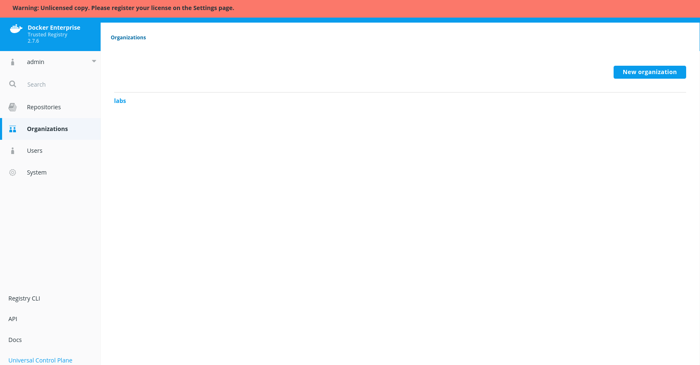

Then we will create a new repository.

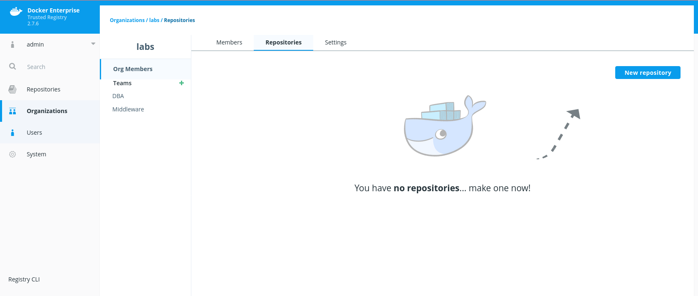

We will create "busybox" as a public repository. This will allow only "lab" users to access this repository.

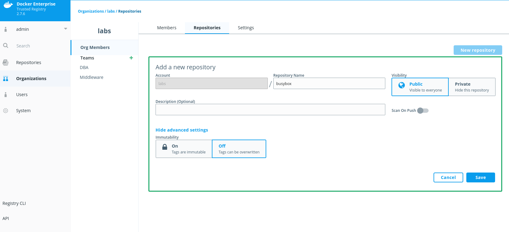

2 - We download and prepare a small "busybox" image to upload it to our new repository.
```
root@enterprise-node3:~# docker pull busybox
Using default tag: latest
latest: Pulling from library/busybox
d9cbbca60e5f: Pull complete 
Digest: sha256:836945da1f3afe2cfff376d379852bbb82e0237cb2925d53a13f53d6e8a8c48c
Status: Downloaded newer image for busybox:latest
docker.io/library/busybox:latest

root@enterprise-node3:~# docker tag busybox 192.168.56.14/labs/busybox:1.0

root@enterprise-node3:~# docker image ls |grep busy
192.168.56.14/labs/busybox   1.0                 78096d0a5478        11 days ago         1.22MB
busybox                      latest              78096d0a5478        11 days ago         1.22MB
```

And now we push our busybox image.

```
root@enterprise-node3:~# docker push 192.168.56.14/labs/busybox:1.0
The push refers to repository [192.168.56.14/labs/busybox]
1079c30efc82: Preparing 
error parsing HTTP 402 response body: invalid character 'D' looking for beginning of value: "DTR doesn't have a license\n"
```

This error is due that our DTR is not licensed. Add your trial license navigating to "System" > "License", and then "Apply new license".

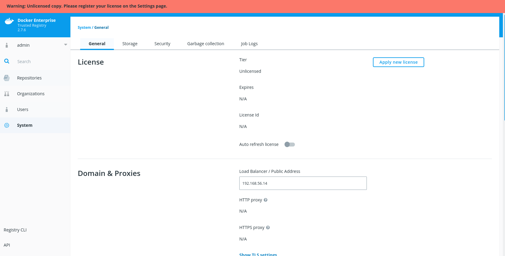

Once license we can continue our process.
```
root@enterprise-node3:~# docker push 192.168.56.14/labs/busybox:1.0
The push refers to repository [192.168.56.14/labs/busybox]
1079c30efc82: Preparing 
denied: requested access to the resource is denied
```

But we still have an error. This is due that we have never logged in DTR yet. Then we have to login in our DTR.
```
root@enterprise-node3:~# docker login 192.168.56.14
Username: admin
Password: 
Login Succeeded
```

Then we can upload our image.
```
root@enterprise-node3:~# docker push 192.168.56.14/labs/busybox:1.0
The push refers to repository [192.168.56.14/labs/busybox]
1079c30efc82: Pushed 
1.0: digest: sha256:a7766145a775d39e53a713c75b6fd6d318740e70327aaa3ed5d09e0ef33fc3df size: 527
```

If you receive errors regarding untrusted certificates, we will need to include DTR certificates in enterprise-node3 host. Follow the instructions included in this link [https://docs.docker.com/ee/dtr/user/access-dtr/](https://docs.docker.com/ee/dtr/user/access-dtr/).


Then we have in our registry as 192.168.56.14/labs/busybox:1.0.

>NOTE: At this point, we can enable image scanning. We navigate to "System" > "Security" and we enable the security scanning feature.
>
>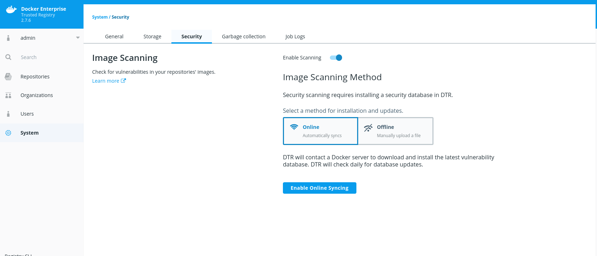
>
>Online scanning is better because CVE database will be updated automatically but this requires Internet connection (we can use proxy).
>Database download can take some time. We will continue with other labs and then we will use this feature once it is ready.

3 - Now we can review "labs/busybox" repository.
We can use ____docker search___. 
```
root@enterprise-node3:~# docker search 192.168.56.14/labs/
NAME                DESCRIPTION         STARS               OFFICIAL            AUTOMATED
labs/busybox        Labs busybox        0     
```

We will remove local images to ensure we are using DTR.
```
root@enterprise-node3:~# docker image rm 192.168.56.14/labs/busybox:1.0 busybox
Untagged: 192.168.56.14/labs/busybox:1.0
Untagged: 192.168.56.14/labs/busybox@sha256:a7766145a775d39e53a713c75b6fd6d318740e70327aaa3ed5d09e0ef33fc3df
Untagged: busybox:latest
Untagged: busybox@sha256:836945da1f3afe2cfff376d379852bbb82e0237cb2925d53a13f53d6e8a8c48c
Deleted: sha256:78096d0a54788961ca68393e5f8038704b97d8af374249dc5c8faec1b8045e42
Deleted: sha256:1079c30efc82c9ad970f01c9a732115b34156fcfd77daf69d65e914bb1de8196
```

Let's check repository using Web UI.

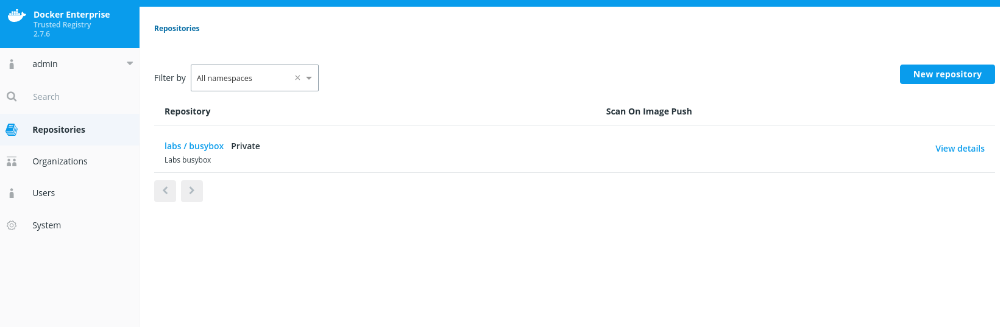

We can enable image scanning or immutability in repository's settings tab.

>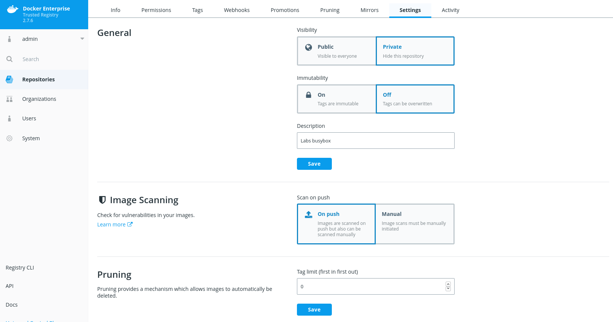

We enabled Scan on Push. This will ensure that all images in this repository will be scanned on each pull. This settings will take effect for new images therefore we have to execute scanning manually.

4 - To execute image scanning, we will navigate to repository's tags section.

>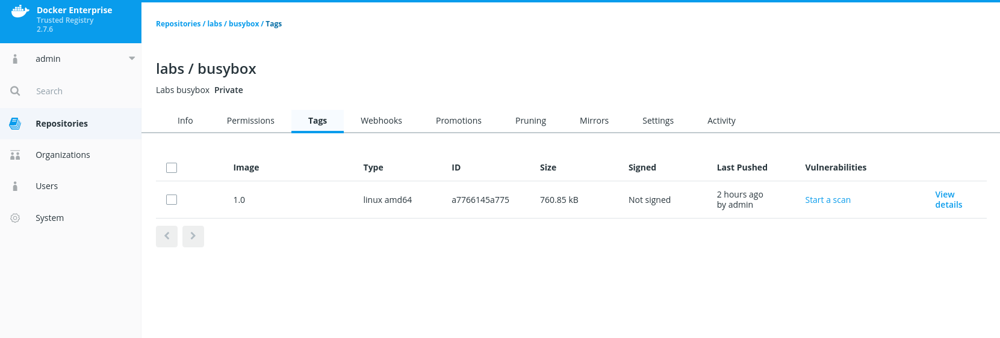

Then we will execute the scan using "Start a Scan". We will click "Start Scan" and DTR will run image scanning. It will stay in "pending" state until it is already finished. 

---

## __Lab3__: Using RBAC access.

In this lab we will learn how to manage the image we have just uploaded. 

1 - As said, "labs/busybox" repository is public for "labs" organization and other organizations too. Then the users we created in UCP's labs (chapter 11) will have access to this repository.
Let's verify accesses for "dba1" and "middleware1" users.
We will login with these users to check if they can get "labs/busybox" images.
```
root@enterprise-node3:~# docker login 192.168.56.14 -u dba1
Password: 
Login Succeeded

root@enterprise-node3:~# docker search 192.168.56.14/labs/
NAME                DESCRIPTION         STARS               OFFICIAL            AUTOMATED
labs/busybox                            0                                       
```

2 - Lets's create another more restrictive repository. Now we will create "private-busybox" repository using Web UI.


We have now two repositories:


3 - To allow user to access this private repository we need to add some permissions. By default "dba1" and "midleware1" users don't have access "labs/private-busybox".

```
root@enterprise-node3:~# docker search 192.168.56.14/labs/
NAME                DESCRIPTION         STARS               OFFICIAL            AUTOMATED
labs/busybox                     
```

We will allow "DBA" users to update and modify images in "labs/private-busybox" repository. Users in "Middleware" team will be able to use images in this repository after the changes.

First we will modify "DBA" access adding "labs/private-busybox" repository as read-write for this team.

We navigate to "Organizations" > "DBA".

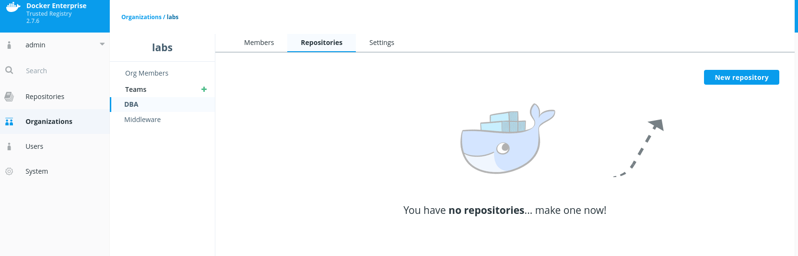

Then we add repository.

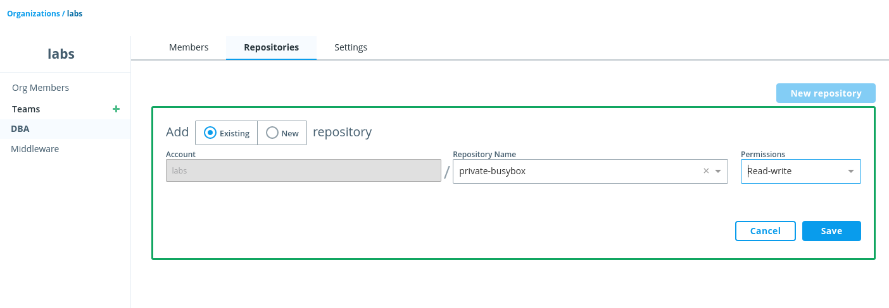

Repository is added as read-write.

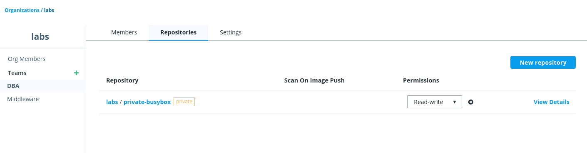

We follow the same steps for "Middleware" team, but we will set this repository as "read-only".

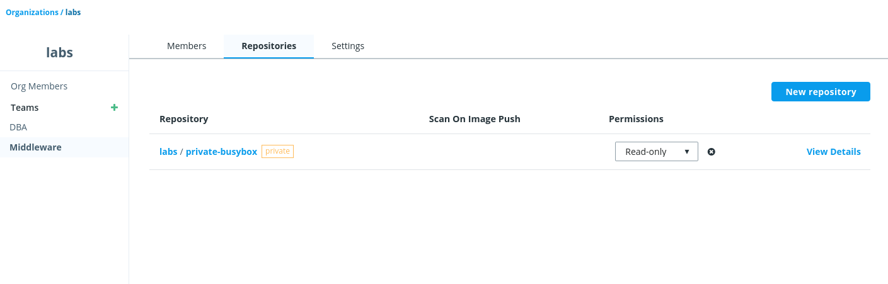

4 - Let's check now acceses:

- DBA
```
root@enterprise-node3:~# docker login 192.168.56.14 -u dba1
Password: 
Login Succeeded

root@enterprise-node3:~# docker search 192.168.56.14/labs/
NAME                   DESCRIPTION         STARS               OFFICIAL            AUTOMATED
labs/busybox                               0                                       
labs/private-busybox                       0                                    
```

- Middleware
```
root@enterprise-node3:~# docker login 192.168.56.14 -u middleware1
Password: 
Login Succeeded

root@enterprise-node3:~# docker search 192.168.56.14/labs/
NAME                   DESCRIPTION         STARS               OFFICIAL            AUTOMATED
labs/busybox                               0                                       
labs/private-busybox                       0  
```

Both users have access to "labs/private-busybox". 

5 - Let's review users permissions. We will create a new image using "docker container commit" procedure. We will just "/TESTFILE" (an empty file) to have a different image digest/hash and ensure we are using a new image.

```
root@enterprise-node3:~# docker run 192.168.56.14/labs/busybox:1.0 touch /TESTFILE
Unable to find image '192.168.56.14/labs/busybox:1.0' locally
1.0: Pulling from labs/busybox
d9cbbca60e5f: Already exists 
Digest: sha256:a7766145a775d39e53a713c75b6fd6d318740e70327aaa3ed5d09e0ef33fc3df
Status: Downloaded newer image for 192.168.56.14/labs/busybox:1.0
```

Now we commit these changes on 192.168.56.14/labs/private-busybox:1.0 image.
```
root@enterprise-node3:~# docker container commit $(docker container ls -ql) 192.168.56.14/labs/private-busybox:1.0
sha256:7d4acade9494749218532782d6c5e31b77a53b5d0e874ec7d2b1edb07b2c824a
```

And now we can login with user "middleware1" and try to upload this new image.
```
root@enterprise-node3:~# docker login 192.168.56.14 -u middleware1
Password: 
Login Succeeded

root@enterprise-node3:~# docker push  192.168.56.14/labs/private-busybox:1.0
The push refers to repository [192.168.56.14/labs/private-busybox]
c29f455e6bce: Preparing 
1079c30efc82: Preparing 
denied: requested access to the resource is denied

```

"middleware1" user can't upload images on "192.168.56.14/labs/private-busybox" repository.

Let's try with user "dba1".
```
root@enterprise-node3:~# docker login 192.168.56.14 -u dba1
Password: 
Login Succeeded

root@enterprise-node3:~# docker push  192.168.56.14/labs/private-busybox:1.0
The push refers to repository [192.168.56.14/labs/private-busybox]
c29f455e6bce: Pushed 
1079c30efc82: Mounted from labs/busybox 
1.0: digest: sha256:87a75d88298aabee731220e46ade42ca3357be792190167a8523d6a4c27408ac size: 734
```

This user is part of "DBA" team and therefore "dba1" user is able to push new images to "labs/private-busybox".

Let's try again if "middleware1" user is able to execute containers using this image. First we remove any local image.
```
root@enterprise-node3:~# docker image rm 192.168.56.14/labs/private-busybox:1.0
Untagged: 192.168.56.14/labs/private-busybox:1.0
Untagged: 192.168.56.14/labs/private-busybox@sha256:87a75d88298aabee731220e46ade42ca3357be792190167a8523d6a4c27408ac
Deleted: sha256:7d4acade9494749218532782d6c5e31b77a53b5d0e874ec7d2b1edb07b2c824a
```

And then we login as user "middleware1" before executing "test" container.
```
root@enterprise-node3:~# docker container run  192.168.56.14/labs/private-busybox:1.0 ls /
Unable to find image '192.168.56.14/labs/private-busybox:1.0' locally
1.0: Pulling from labs/private-busybox
d9cbbca60e5f: Already exists 
fed87fc839f4: Already exists 
Digest: sha256:87a75d88298aabee731220e46ade42ca3357be792190167a8523d6a4c27408ac
Status: Downloaded newer image for 192.168.56.14/labs/private-busybox:1.0
TESTFILE
bin
dev
etc
home
proc
root
sys
tmp
usr
var
```

We can add an "external" user, who is not part of neither "DBA" nor "Middleware" teams. This user will not be able to use "labs/private-busybox" images.
```
root@enterprise-node3:~# docker login 192.168.56.14 -u external
Password: 
Login Succeeded

root@enterprise-node3:~# docker container run  192.168.56.14/labs/private-busybox:1.0 ls /
Unable to find image '192.168.56.14/labs/private-busybox:1.0' locally
docker: Error response from daemon: pull access denied for 192.168.56.14/labs/private-busybox, repository does not exist or may require 'docker login': denied: requested access to the resource is denied.
```

>NOTE: Ensure that all "busibox" image's tags are removed for these labs.


But "external" user will be able to use public repositories.

```
root@enterprise-node3:~# docker image ls|grep busy

root@enterprise-node3:~# docker container run  192.168.56.14/labs/busybox:1.0 ls /
Unable to find image '192.168.56.14/labs/busybox:1.0' locally
1.0: Pulling from labs/busybox
Digest: sha256:a7766145a775d39e53a713c75b6fd6d318740e70327aaa3ed5d09e0ef33fc3df
Status: Downloaded newer image for 192.168.56.14/labs/busybox:1.0
bin
dev
etc
home
proc
root
sys
tmp
usr
var
```

## __Lab4__: Using Image promotions.

In this lab we will learn how image promotions are manage in DTR. We will add a private repository for "DBA" users. This repository will be "invisible" for "Middleware" users. But they will be able to use "alpine" image releases tagged as "release"

1 - First we add two private repositories for "DBA" and "Middleware" teams.

We add two repositories as mentioned:
- DBA
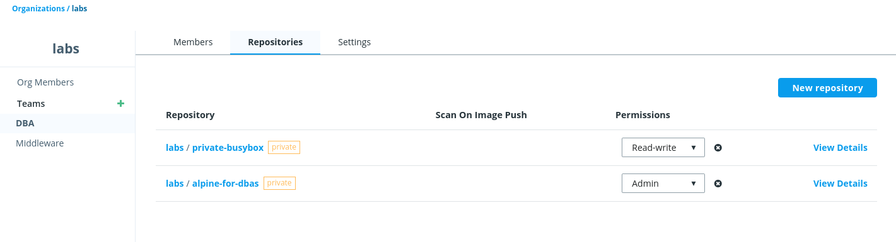

- Middleware
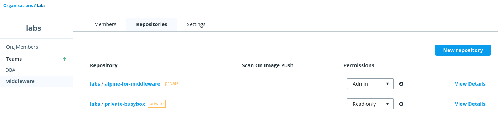

2 - Let's create some promotion rules.

- alpine-for-dbas:<*>release images will be promoted to alpine-for-middleware repository.

Following pictures show the process of adding one simple promotion using tags ended by "release" strings.

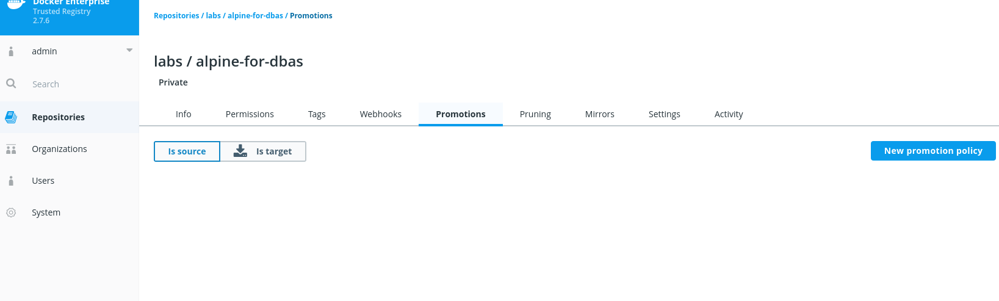

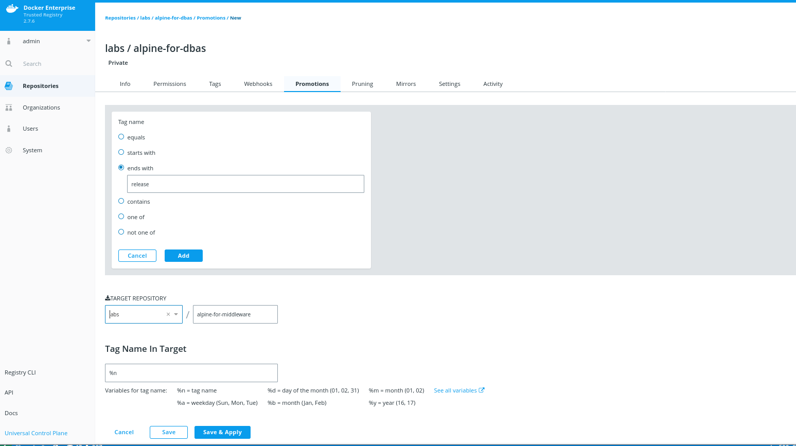

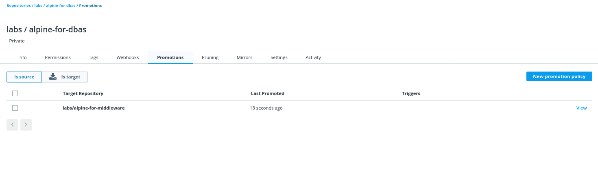

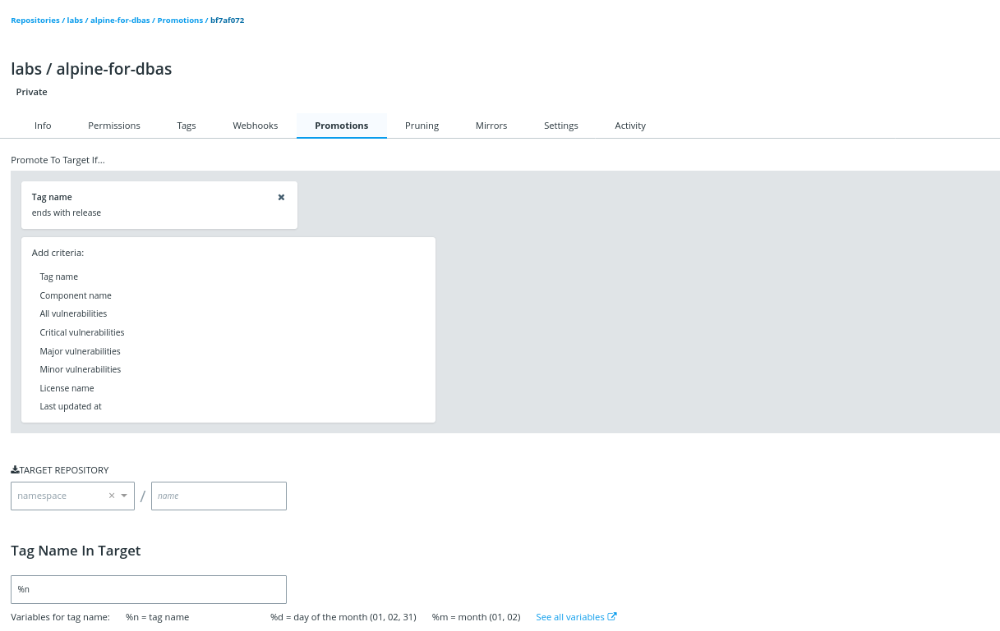


3 - Now we will create some images with alpine.
```
root@enterprise-node3:~# docker pull alpine
Using default tag: latest
latest: Pulling from library/alpine
cbdbe7a5bc2a: Already exists 
Digest: sha256:9a839e63dad54c3a6d1834e29692c8492d93f90c59c978c1ed79109ea4fb9a54
Status: Downloaded newer image for alpine:latest
docker.io/library/alpine:latest
```

Then we create some tags (promotion can be triggered using different procedures, but in this case we will just use image tags).
```
root@enterprise-node3:~# docker tag alpine 192.168.56.14/labs/alpine-for-dbas:1.0
```

Then we can push 192.168.56.14/labs/alpine-for-dbas:1.0.
```
root@enterprise-node3:~# docker login 192.168.56.14 -u dba1
Password: 
Login Succeeded

root@enterprise-node3:~# docker push  192.168.56.14/labs/alpine-for-dbas:1.0
The push refers to repository [192.168.56.14/labs/alpine-for-dbas]
3e207b409db3: Pushed 
1.0: digest: sha256:39eda93d15866957feaee28f8fc5adb545276a64147445c64992ef69804dbf01 size: 528

root@enterprise-node3:~# docker tag alpine 192.168.56.14/labs/alpine-for-dbas:1.1

root@enterprise-node3:~# docker push  192.168.56.14/labs/alpine-for-dbas:1.1     
The push refers to repository [192.168.56.14/labs/alpine-for-dbas]
3e207b409db3: Layer already exists 
1.1: digest: sha256:39eda93d15866957feaee28f8fc5adb545276a64147445c64992ef69804dbf01 size: 528
```
Then we add a simple file to make a "release" image. This is fiction for this lab, but in real development, we will have some images ready to be tested. They can be set as releases and therefore following promotion rules, they will be able to another department/group or process within CI/CD pipeline.

We will just add one file to the image to change its digest/hashes adding one layer.
```
root@enterprise-node3:~# docker container run 192.168.56.14/labs/alpine-for-dbas:1.1 touch /TESTFILE_AGAIN

root@enterprise-node3:~# docker container commit $(docker container ls -ql) 192.168.56.14/labs/alpine-for-dbas:1.2-release
sha256:8d863ada523f26b87380a7286ace2aa1ea3541c9990391679fb6d03e14550508
```

Now that we have a release image, we can push this new image:
```
root@enterprise-node3:~# docker image push 192.168.56.14/labs/alpine-for-dbas:1.2-release
The push refers to repository [192.168.56.14/labs/alpine-for-dbas]
d04bd74c25b0: Pushed 
3e207b409db3: Layer already exists 
1.2-release: digest: sha256:aa65c17fad024fe75951fe49fcf52333b27c7076403c762f7fd30847f38b6294 size: 735
```

4 - Now we can review images using "middleware1" user:
```
root@enterprise-node3:~# docker login 192.168.56.14 -u middleware1
Password: 
Login Succeeded

root@enterprise-node3:~# docker search 192.168.56.14/labs/alpine-for-dba/
NAME                DESCRIPTION         STARS               OFFICIAL            AUTOMATED

root@enterprise-node3:~# docker search 192.168.56.14/labs/alpine-for-middleware
NAME                         DESCRIPTION         STARS               OFFICIAL            AUTOMATED
labs/alpine-for-middleware                       0                                       
```

As mentioned, images with tags including "release" at the end were promoted. 

5 - Image promoted from "labs/alpine-for-dba" to "labs/alpine-for-middleware" and we can review this behavior in DTR's Web UI.

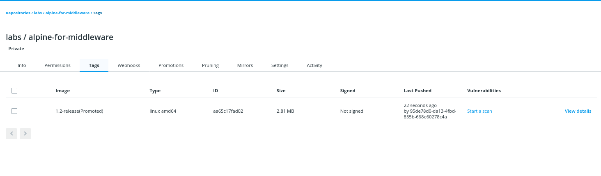

If we review the images pushed to "labs/alpine-for-dba" we can observe that there are more images.

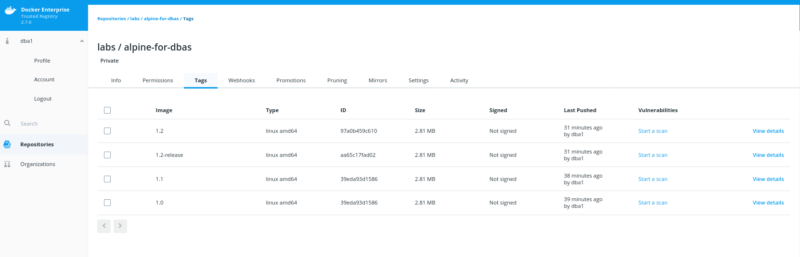


